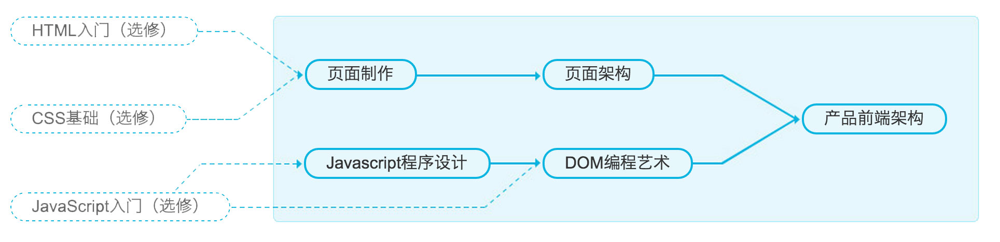

# NetEase Front-end Nanodegree Note

## 知识体系内容记录

### Javascript 程序设计

 [详情](JavascriptDesignPattern.md)

### 页面制作

 [详情](WebCreation.md)

### DOM 编程

 [详情](#)

### 页面架构

 [详情](#)

### 产品前端架构

 [详情](#)

## 相关资源

- [Javascript 书单](Booklist.md)