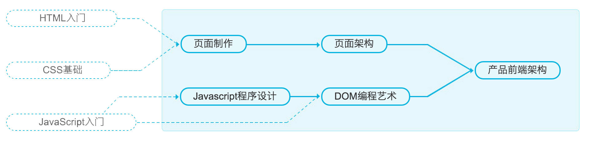

# 前端开发笔记本

点击[这里](https://www.gitbook.com/read/book/li-xinyang/frontend-notebook)开始阅读！

前端开发笔记本的 GitHub 地址在[这里](https://github.com/li-xinyang/FEND_Note)。如果你觉得这个项目不错，请点击 Star 一下，您的支持是我最大的动力。

<!-- Place this tag where you want the button to render. -->
<a class="github-button" href="https://github.com/li-xinyang/FEND_Note" data-style="mega" data-count-href="/li-xinyang/FEND_Note/stargazers" data-count-api="/repos/li-xinyang/FEND_Note#stargazers_count" data-count-aria-label="# stargazers on GitHub" aria-label="Star li-xinyang/FEND_Note on GitHub">Star</a>
&nbsp;&nbsp;<a class="github-button" href="https://github.com/li-xinyang/FEND_Note" data-style="mega" data-count-href="/li-xinyang/FEND_Note/watchers" data-count-api="/repos/li-xinyang/FEND_Note#subscribers_count" data-count-aria-label="# watchers on GitHub" aria-label="Watch li-xinyang/FEND_Note on GitHub">Watch</a>
&nbsp;&nbsp;<a class="github-button" href="https://github.com/li-xinyang/FEND_Note/fork" data-style="mega" data-count-href="/li-xinyang/FEND_Note/network" data-count-api="/repos/li-xinyang/FEND_Note#forks_count" data-count-aria-label="# forks on GitHub" aria-label="Fork li-xinyang/FEND_Note on GitHub">Fork</a>
&nbsp;&nbsp;<a class="github-button" href="https://github.com/li-xinyang/FEND_Note/archive/master.zip" data-style="mega" aria-label="Download li-xinyang/FEND_Note on GitHub">Download</a>

### 写作进程

|章节|名称|进程|
|----|----|----|
|第一章|页面制作||
|第二章|JavaScript 程序设计||
|第三章|DOM 编程||
|第四章|页面构架||
|第五章|前端产品构架||

### 相关链接

- [NEC](http://nec.netease.com/) {N: nice, E: easy, C: css;}

 This work by <a xmlns:cc="http://creativecommons.org/ns#" href="li-xinyang.com" property="cc:attributionName" rel="cc:attributionURL">Li Xinyang</a> is licensed under a <a rel="license" href="http://creativecommons.org/licenses/by-nc-sa/4.0/">Creative Commons Attribution-NonCommercial-ShareAlike 4.0 International License</a>.

<!-- Place this tag right after the last button or just before your close body tag. -->
