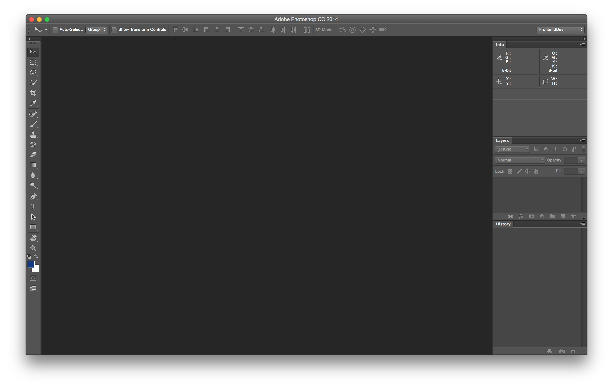
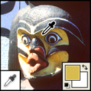
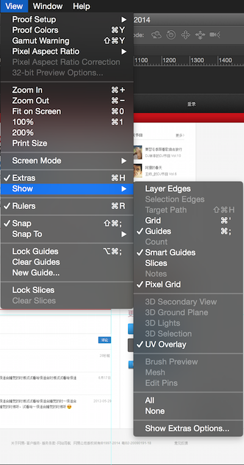
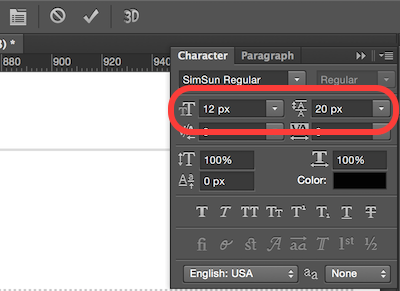
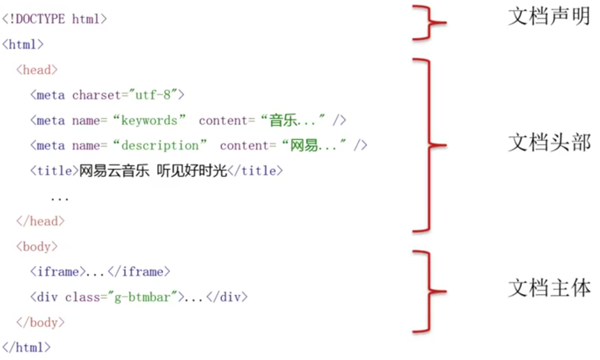

<!-- START doctoc generated TOC please keep comment here to allow auto update -->
<!-- DON'T EDIT THIS SECTION, INSTEAD RE-RUN doctoc TO UPDATE -->

- [网页制作](#%E7%BD%91%E9%A1%B5%E5%88%B6%E4%BD%9C)
  - [概述](#%E6%A6%82%E8%BF%B0)
  - [Photoshop](#photoshop)
    - [工具, 面板, 视图](#%E5%B7%A5%E5%85%B7-%E9%9D%A2%E6%9D%BF-%E8%A7%86%E5%9B%BE)
    - [测量及取色](#%E6%B5%8B%E9%87%8F%E5%8F%8A%E5%8F%96%E8%89%B2)
    - [切图](#%E5%88%87%E5%9B%BE)
    - [保存](#%E4%BF%9D%E5%AD%98)
      - [保存格式的选择](#%E4%BF%9D%E5%AD%98%E6%A0%BC%E5%BC%8F%E7%9A%84%E9%80%89%E6%8B%A9)
    - [图片修改与维护](#%E5%9B%BE%E7%89%87%E4%BF%AE%E6%94%B9%E4%B8%8E%E7%BB%B4%E6%8A%A4)
    - [图片优化与合并](#%E5%9B%BE%E7%89%87%E4%BC%98%E5%8C%96%E4%B8%8E%E5%90%88%E5%B9%B6)
      - [图片的兼容](#%E5%9B%BE%E7%89%87%E7%9A%84%E5%85%BC%E5%AE%B9)
  - [开发及调试工具](#%E5%BC%80%E5%8F%91%E5%8F%8A%E8%B0%83%E8%AF%95%E5%B7%A5%E5%85%B7)
  - [HTML](#html)
    - [HTML 历史](#html-%E5%8E%86%E5%8F%B2)
    - [HTML 简介](#html-%E7%AE%80%E4%BB%8B)
    - [HTML 语法](#html-%E8%AF%AD%E6%B3%95)
      - [全局属性](#%E5%85%A8%E5%B1%80%E5%B1%9E%E6%80%A7)
    - [HTML 标签](#html-%E6%A0%87%E7%AD%BE)
    - [文本标签](#%E6%96%87%E6%9C%AC%E6%A0%87%E7%AD%BE)
    - [组合内容标签](#%E7%BB%84%E5%90%88%E5%86%85%E5%AE%B9%E6%A0%87%E7%AD%BE)
    - [表单](#%E8%A1%A8%E5%8D%95)
      - [input 类型支持值列表](#input-%E7%B1%BB%E5%9E%8B%E6%94%AF%E6%8C%81%E5%80%BC%E5%88%97%E8%A1%A8)
    - [语义化](#%E8%AF%AD%E4%B9%89%E5%8C%96)
    - [实体字符](#%E5%AE%9E%E4%BD%93%E5%AD%97%E7%AC%A6)
  - [CSS](#css)
    - [简介](#%E7%AE%80%E4%BB%8B)
    - [语法](#%E8%AF%AD%E6%B3%95)
    - [选择器](#%E9%80%89%E6%8B%A9%E5%99%A8)
      - [简单选择器](#%E7%AE%80%E5%8D%95%E9%80%89%E6%8B%A9%E5%99%A8)
      - [其他选择器](#%E5%85%B6%E4%BB%96%E9%80%89%E6%8B%A9%E5%99%A8)
      - [继承、优先、层级](#%E7%BB%A7%E6%89%BF%E3%80%81%E4%BC%98%E5%85%88%E3%80%81%E5%B1%82%E7%BA%A7)
    - [文版](#%E6%96%87%E7%89%88)
      - [字体](#%E5%AD%97%E4%BD%93)
      - [对齐方式](#%E5%AF%B9%E9%BD%90%E6%96%B9%E5%BC%8F)
      - [格式处理](#%E6%A0%BC%E5%BC%8F%E5%A4%84%E7%90%86)
      - [文本装饰](#%E6%96%87%E6%9C%AC%E8%A3%85%E9%A5%B0)
      - [高级设置](#%E9%AB%98%E7%BA%A7%E8%AE%BE%E7%BD%AE)
    - [盒模型](#%E7%9B%92%E6%A8%A1%E5%9E%8B)
    - [背景](#%E8%83%8C%E6%99%AF)
    - [布局](#%E5%B8%83%E5%B1%80)
    - [变形](#%E5%8F%98%E5%BD%A2)
    - [动画](#%E5%8A%A8%E7%94%BB)

<!-- END doctoc generated TOC please keep comment here to allow auto update -->

# 网页制作

## 概述

**网页发展史**

Web 1.0 -> Web 2.0（基于 Ajax） -> Web 3.0 （基于 HTML5）

**协作流程**


**前端职责**

视觉稿（配色图标距离空间） + 交互稿（用户逻辑） = UI （用户界面）

视觉稿 -> [页面制作]

交互稿 -> [页面逻辑开发]

**所需技能**

- DOM (操作 HTML 及 CSS 的接口)
- JavaScript (定义页面互动)
- CSS (定义页面样式)
- HTML (定义页面结果)
- Photoshop (取图)

## Photoshop

**切图** 从设计稿中切除网页的素材并在代码中引入图片 (复杂的图片或者解决兼容问题)

```html
// 设计稿 (*.psd) -> 产出物 (*png, *.jpg)


<style type="text/css" media="screen">
  background-image: url(../img/sprite.png);
  background-position: 0 0;
</style>
```

### 工具, 面板, 视图

在全局设置下将单位修改为像素，因其在 CSS 中运用最广。设置工作区布局为切图及图片编辑做准备。



**切图常用工具**

|工具名|示意图|注释|
|------|:----:|----|
|移动工具| ||
|矩形选框工具| ||
|魔棒工具||（容差 Tolerance 越小选择的范围就越小）|
|剪裁工具|  ||
|切片工具| ||
|缩放工具| ||
|取色器| ||

图层（单层元素）与组（类似于文件夹）的区别。

**辅助视图**，在视图菜单下启动

- 对齐，会启动靠近吸附功能
- 标尺，<kbd>Command</kbd> + <kbd>R</kbd>
- 参考线，<kbd>Command</kbd> + <kbd>;</kbd>



NOTE: 所有工具及快捷键如下。


### 测量及取色

所有能接受数字的属性都需要测量并尽可能百分百的还原设计稿。

- 宽度，高度 (width, height)
- 内外边距 (padding, margin)
- 边框 (border)
- 定位 (position)
- 文字大小 (font-size)
- 行高 (line-height)
- 背景位置 (background-position)

NOTE: 测量时尽可能放大画布以减少误差。量取文字是为了减少误差尽量选取尺寸大的文字进行测量。



**选框工具的多用途**，增（Shift）减（Alt）以及交叉选择（Shift + Alt）。左右（或上下）使用分离选框选择可以得到整两个分离边框的距离总值。


所有能接受颜色的属性都需要取色。

- 边框色
- 背景色
- 文字色

NOTE: 使用魔棒工具可以迅速识别背景色是否没*线性*渐变的方法。Mac OS X 推荐使用 **Sip** 可在 Mac App Store 免费下载。

### 切图

修饰性图标和内容性图片需要（在 HTML 的 `` 之中，只需站位不需切图）切出。切出的内容性图片应保存为 `*.jpg` 格式，而修饰性图片因保存为 `png24`（IE6 不支持半透明） 或 `png8` 它们不支持全透明。

**隐藏文字**，方法一，之间在图层中隐藏文字图层。方法二（两种，分别应对于纯色和有背景需要隐藏文本的情况）如下图所示。


**PNG24**切图方法
- 移动工具选中所需图层（Ctrl 多选）
- 右键合并图层（Ctrl + E）
- 复制到新图层

**PNG8**带背景切图方法
- 合并可见图层（Shift + Ctrl + E）
- 矩形选框选择内容
- 魔棒工具去除多余部分（Alt + 选取）

**可平铺**背景的切图方法
- 用矩形选择一个区域
- 复制至新图层

NOTE: X 轴平铺需要占满图片的宽，Y 轴平铺需要占满图片的高。

**切片**工具（大图化小的方法，将一大图分为多小图）
- 拉参考线
- 选择切片工具
- 点击 “基于参考线的切片” 按钮
- 选择切片选择工具
- 保存于新图层

### 保存

将需要的内容保存在独立的文件里便于之后的导出。（存储于 Web 所用格式 Alt + Shift + Ctrl + S）

**独立图层** 把需要的图层拖到新建的透明背景的图层，或在图层上右键复制（Duplicate）图层选择地址为新文件即可。

**图片与背景合并**的切图方法如下


#### 保存格式的选择

保存类型一：色彩丰富切无透明要求时保存为 `JPG` 格式并选用时候的品质（通常使用品质 80 ）。

保存类型二：图片色彩不丰富，不伦透明与否一律保存为 `PNG8` 格式（256颜色，需特殊设置如下图）。


保存类型三：图片有半透明的要求，保存为 `PNG24` 格式（不对图片进行压缩）。

保存类型四：保留 PSD 源文件，以备不时之需。

### 图片修改与维护

维护与修改之一：**更改画布**大小以便增加新素材。


维护与修改之二：移动图标分两种，独立图层（移动工具拖动），于非独立图层（选取工具选中分离后移动工具拖动）。


维护与修改之三：**裁剪画布**的方法有两种，(1)用选取工具选取后图片裁取，(2)直接用裁剪工具裁剪画布。


**注意事项**：为了可维护性的考虑因适当的留出适当的空白区域以便修改所用和提高容错性。`PNG8`需更改图片颜色模式为 RGB 颜色（默认为索引颜色模式，颜色信息会被丢失）。


### 图片优化与合并

在 HTML 中使用背景图片的方法如下：

```html
<button type="button" class="btn-default">Click Me</button>

<style type="text/css" media="screen">
  .btn-default {
  background: url(image/btn.png) no-repeat 0 0;
}
.btn-default-alt {
background: url(image/sprite.png) no-repeat 0 -50px;
}
</style>
```

图片的**合并**就如同上面提到的切图后保存的过程。拼好的图称之为 **Sprite** 它能减少网络请求次数提高速度。图片压缩工具分为无损（ImageOptim 等工具，也可结合 Grunt 自动化构建工具一同使用）与有损压缩工具（TinyPng）。

合并的图片可以以横向或纵向的排列，分类可将同属于一个模块（功能模块），大小相近（充分利用画布空间），颜色相近（减少文件大小）。

#### 图片的兼容

IE6 不支持 PNG24 半透明所以需要保存两份（sprite.png - png24 和 sprite-ie.png - 8）。在使用 CSS3 是让高级浏览器使用 CSS3 低级浏览器则使用切图。优雅降级指的是让低级浏览器不显示高级浏览器中的界面细节。

## 开发及调试工具

- 文本编辑器 && IDE (集成开发环境)
- Google Chrome, Firefox Firebug, Safari Developer Tool

NOTE: [Google Chrome DevTools Doc](https://developer.chrome.com/devtools)

## HTML

### HTML 历史

HTML (Hyper Text Markup Language)，用于标记页面中的内容。


### HTML 简介



注意事项：

- `<!DOCTYPE html>` 必须首行定格
- `<title>` 为文档标题
- `<meta charset="utf-8">` 文档解码格式
- `<meta name="keywords" content="...">` 和 `<meta name="description" content="...">` 提供给搜索引擎使用
- `<meta name="viewport" content="width=device-width, initial-scale=1.0">` 移动端浏览器的宽高与缩放
- `<link>` 标签可以引入 favicon 和样式表 CSS 文件

### HTML 语法


**书写规范**：

- 小写标签和属性
- 属性值双引号
- 代码因嵌套缩进

#### 全局属性

- id, `<div id='unique-element'></div>`，页面中唯一
- class，`<button class='btn'>Click Me</button>`，页面中课重复出现
- style，尽量避免
- title，对于元素的描述类似于 Tool Tip 的效果。

### HTML 标签

**[HTML5 标签集合](http://www.html5star.com/manual/html5label-meaning)**


### 文本标签

```html
<!-- 默认超链接  -->
<a href="http://sample-link.com" title="Sample Link">Sample</a>
<!-- 当前窗口显示 -->
<a href="http://sample-link.com" title="Sample Link" target="_self">Sample</a>
<!-- 新窗口显示 -->
<a href="http://sample-link.com" title="Sample Link" target="_blacnk">Sample</a>
<!-- iframe 中打开链接 -->
<a href="http://sample-link.com" title="Sample Link" target="iframe-name">Sample</a>
<iframe name="iframe-name" frameborder="0"></iframe>

<!-- 页面中的锚点 -->
<a href="#achor">Achor Point</a>
<section id="achor">Achor Content</section>

<!-- 邮箱及电话需系统支持 -->
<a href="mailto:sample-address@me.com" title="Email">Contact Us</a>
<!-- 多个邮箱地址 -->
<a href="mailto:sample-address@me.com, sample-address0@me.com" title="Email">Contact Us</a>
<!-- 添加抄送，主题和内容 -->
<a href="mailto:sample-address@me.com?cc=admin@me.com&subject=Help&body=sample-body-text" title="Email">Contact Us</a>

<!-- 电话示例 -->
<a href="tel:99999999" title="Phone">Ring Us</a>
```

### 组合内容标签

- `<div>`
- `<p>`
- `<ol>`
- `<ul>`
- `<dl>`
- `<pre>`
- `<blockquote>`

NOTE: `<dl>` 为自定义列表，其中包含一个或多个 `<dt>` 及 一个或多个 `<dd>` 。`<pre>` 会保留换行和空格，通常与 `<code>` 一同使用。

```html
<pre>
  <code>
    int main(void) {
    printf('Hello, world!');
    return 0;
  }
</code>
</pre>
```

`<blockquote>` 拥有 `cite` 属性，它包含引用文本的出处，示例如下所示：

```html
<blockquote cite="http://example.com/facts">
  <p>Sample Quote...</p>
</blockquote>
```

### 表单

```html
<form action="WebCreation_submit" method="get" accept-charset="utf-8">
  <fieldset>
    <legend>title or explanatory caption</legend>
    <!-- 第一种添加标签的方法 -->
    <label><input type="text/submit/hidden/button/etc" name="" value=""></label>
    <!-- 第二种添加标签的方法 -->
    <label for="input-id">Sample Label</label>
    <input type="text" id="input-id">
  </fieldset>
  <fieldset>
    <legend>title or explanatory caption</legend>
    <!-- 只读文本框 -->
    <input type="text" readonly>
    <!-- 隐藏文本框，可提交影藏数据 -->
    <input type="text" name="hidden-info" value="hiden-info-value" hidden>
  </fieldset>
  <button type="submit">Submit</button>
  <button type="reset">Reset</button>
</form>
```

#### input 类型支持值列表

<table class="reference notranslate">
  <tbody><tr>
    <th style="width:22%">Value</th>
    <th>Description</th>
  </tr>
  <tr>
    <td>button</td>
    <td>Defines a clickable button (mostly used with a JavaScript to activate a script)</td>
  </tr>
  <tr>
    <td>checkbox</td>
    <td>Defines a checkbox</td>
  </tr>
  <tr>
  <td class="html5badge">color</td>
    <td>Defines a color picker</td>
  </tr>
  <tr>
  <td class="html5badge">date</td>
    <td>Defines a date control (year, month and day (no time))</td>
  </tr>
  <tr>
  <td class="html5badge">datetime</td>
    <td>The input type datetime has been removed from the HTML standard. Use datetime-local instead.</td>
    </tr>
    <tr>
    <td class="html5badge">datetime-local</td>
      <td>Defines a date and time control (year, month, day, hour, minute, second, and fraction of a second (no time zone)</td>
      </tr>
      <tr>
      <td class="html5badge">email</td>
        <td>Defines a field for an e-mail address</td>
      </tr>
      <tr>
        <td>file</td>
        <td>Defines a file-select field and a "Browse..." button (for file uploads)</td>
      </tr>
      <tr>
        <td>hidden</td>
        <td>Defines a hidden input field</td>
      </tr>
      <tr>
        <td>image</td>
        <td>Defines an image as the submit button</td>
      </tr>
      <tr>
      <td class="html5badge">month</td>
        <td>Defines a month and year control (no time zone)</td>
      </tr>
      <tr>
      <td class="html5badge">number</td>
        <td>Defines a field for entering a number</td>
      </tr>
      <tr>
        <td>password</td>
        <td>Defines a password field (characters are masked)</td>
      </tr>
      <tr>
        <td>radio</td>
        <td>Defines a radio button</td>
      </tr>
      <tr>
      <td class="html5badge">range</td>
        <td>Defines a control for entering a number whose exact value is not important (like a slider control)</td>
      </tr>
      <tr>
        <td>reset</td>
        <td>Defines a reset button (resets all form values to default values)</td>
      </tr>
      <tr>
      <td class="html5badge">search</td>
        <td>Defines a text field for entering a search string</td>
      </tr>
      <tr>
        <td>submit</td>
        <td>Defines a submit button</td>
      </tr>
      <tr>
      <td class="html5badge">tel</td>
        <td>Defines a field for entering a telephone number</td>
      </tr>
      <tr>
        <td>text</td>
        <td>Default. Defines a single-line text field (default width is 20 characters)</td>
      </tr>
      <tr>
      <td class="html5badge">time</td>
        <td>Defines a control for entering a time (no time zone)</td>
      </tr>
      <tr>
      <td class="html5badge">url</td>
        <td>Defines a field for entering a URL</td>
      </tr>
      <tr>
      <td class="html5badge">week</td>
        <td>Defines a week and year control (no time zone)</td>
      </tr>
    </tbody>
</table>

**其他页面控件**

- `textarea`
- `select` 与 `option`

### 语义化

语义化（Semantic Tag）是指用合适的标签标识适当的内容，它可以起到搜索引擎优化，提高可访问性（例如盲人使用的屏幕阅读器），与此同时还可以提高代码的可读性。

### 实体字符

实体字符（ASCII Encoding Reference）是用来在代码中以实体代替与HTML语法相同的字符，避免浏览解析错误。它的两种表示方式，第一种为 `&` 外加实体字符名称，例如 `&nbsp;`，第二种为 `&` 加实体字符序号，例如 `&#160;`。

<table>
    <caption>常用HTML字符实体（建议使用实体）：</caption>
    <thead>
        <tr>
            <th>字符</th>
            <th>名称</th>
            <th>实体名</th>
            <th>实体数</th>
        </tr>
    </thead>
    <tbody>
        <tr>
            <td>&quot;</td>
            <td>双引号</td>
            <td>&amp;quot;</td>
            <td>&amp;#34;</td>
        </tr>
        <tr>
            <td>&amp;</td>
            <td>&amp;符</td>
            <td>&amp;amp;</td>
            <td>&amp;#38;</td>
        </tr>
        <tr>
            <td>&lt;</td>
            <td>左尖括号（小于号）</td>
            <td>&amp;lt;</td>
            <td>&amp;#60;</td>
        </tr>
        <tr>
            <td>&gt;</td>
            <td>右尖括号（大于号）</td>
            <td>&amp;gt;</td>
            <td>&amp;#62;</td>
        </tr>
        <tr>
            <td>&nbsp;</td>
            <td>空格</td>
            <td>&amp;nbsp;</td>
            <td>&amp;#160;</td>
        </tr>
        <tr>
            <td>&#12288;</td>
            <td>中文全角空格</td>
            <td>&nbsp;</td>
            <td>&amp;#12288;</td>
        </tr>
    </tbody>
</table>

<table>
    <caption>常用特殊字符实体（不建议使用实体）：</caption>
    <thead>
        <tr>
            <th>字符</th>
            <th>名称</th>
            <th>实体名</th>
            <th>实体数</th>
        </tr>
    </thead>
    <tbody>
        <tr>
            <td>&yen;</td>
            <td>元</td>
            <td>&amp;yen;</td>
            <td>&amp;#165;</td>
        </tr>
        <tr>
            <td>&brvbar;</td>
            <td>断竖线</td>
            <td>&amp;brvbar;</td>
            <td>&amp;#166;</td>
        </tr>
        <tr>
            <td>&copy;</td>
            <td>版权</td>
            <td>&amp;copy;</td>
            <td>&amp;#169;</td>
        </tr>
        <tr>
            <td>&reg;</td>
            <td>注册商标R</td>
            <td>&amp;reg;</td>
            <td>&amp;#174;</td>
        </tr>
        <tr>
            <td>&trade;</td>
            <td>商标TM</td>
            <td>&amp;trade;</td>
            <td>&amp;#8482;</td>
        </tr>
        <tr>
            <td>&middot;</td>
            <td>间隔符</td>
            <td>&amp;middot;</td>
            <td>&amp;#183;</td>
        </tr>
        <tr>
            <td>&laquo;</td>
            <td>左双尖括号</td>
            <td>&amp;laquo;</td>
            <td>&amp;#171;</td>
        </tr>
        <tr>
            <td>&raquo;</td>
            <td>右双尖括号</td>
            <td>&amp;raquo;</td>
            <td>&amp;#187;</td>
        </tr>
        <tr>
            <td>&deg;</td>
            <td>度</td>
            <td>&amp;deg;</td>
            <td>&amp;#176;</td>
        </tr>
        <tr>
            <td>&times;</td>
            <td>乘</td>
            <td>&amp;times;</td>
            <td>&amp;#215;</td>
        </tr>
        <tr>
            <td>&divide;</td>
            <td>除</td>
            <td>&amp;divide;</td>
            <td>&amp;#247;</td>
        </tr>
        <tr>
            <td>&permil;</td>
            <td>千分比</td>
            <td>&amp;permil;</td>
            <td>&amp;#8240;</td>
        </tr>
    </tbody>
</table>

NOTE：具体所需可在使用时查询，无需记忆。

## CSS

### 简介

### 语法

### 选择器

#### 简单选择器

#### 其他选择器

#### 继承、优先、层级

### 文版

#### 字体

#### 对齐方式

#### 格式处理

#### 文本装饰

#### 高级设置

### 盒模型

### 背景

### 布局

### 变形

### 动画