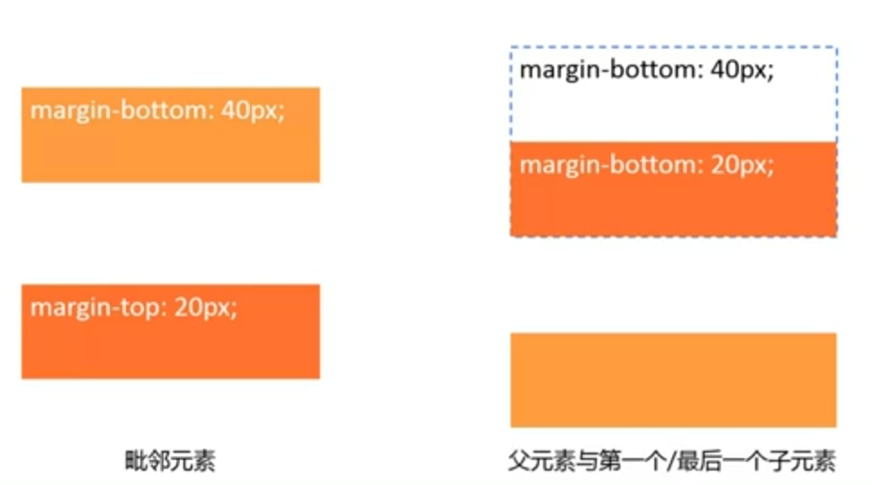
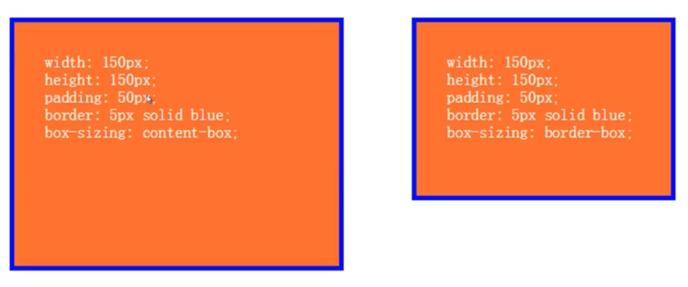
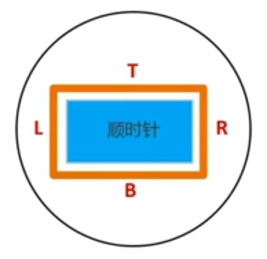
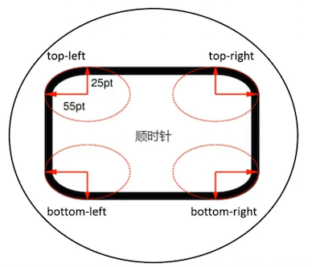
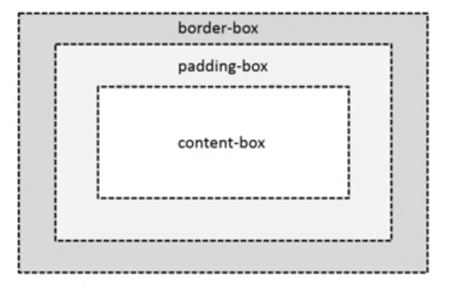
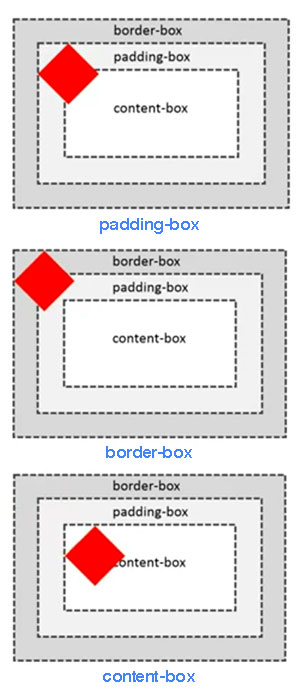
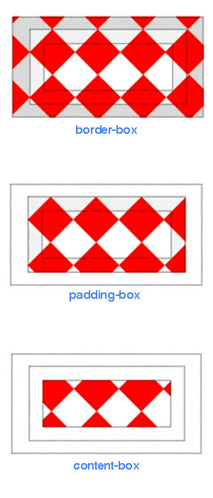

<!-- START doctoc generated TOC please keep comment here to allow auto update -->
<!-- DON'T EDIT THIS SECTION, INSTEAD RE-RUN doctoc TO UPDATE -->
**Table of Contents**  *generated with [DocToc](https://github.com/thlorenz/doctoc)*

- [文本](#%E6%96%87%E6%9C%AC)
  - [字体](#%E5%AD%97%E4%BD%93)
    - [改变字号](#%E6%94%B9%E5%8F%98%E5%AD%97%E5%8F%B7)
    - [改变字体](#%E6%94%B9%E5%8F%98%E5%AD%97%E4%BD%93)
    - [加粗字体](#%E5%8A%A0%E7%B2%97%E5%AD%97%E4%BD%93)
    - [倾斜字体](#%E5%80%BE%E6%96%9C%E5%AD%97%E4%BD%93)
    - [更改行距](#%E6%9B%B4%E6%94%B9%E8%A1%8C%E8%B7%9D)
    - [font shorthand](#font-shorthand)
    - [改变文字颜色](#%E6%94%B9%E5%8F%98%E6%96%87%E5%AD%97%E9%A2%9C%E8%89%B2)
  - [对齐方式](#%E5%AF%B9%E9%BD%90%E6%96%B9%E5%BC%8F)
    - [文字居中](#%E6%96%87%E5%AD%97%E5%B1%85%E4%B8%AD)
    - [文本垂直对齐](#%E6%96%87%E6%9C%AC%E5%9E%82%E7%9B%B4%E5%AF%B9%E9%BD%90)
    - [文本缩进](#%E6%96%87%E6%9C%AC%E7%BC%A9%E8%BF%9B)
  - [格式处理](#%E6%A0%BC%E5%BC%8F%E5%A4%84%E7%90%86)
    - [保留空格格式](#%E4%BF%9D%E7%95%99%E7%A9%BA%E6%A0%BC%E6%A0%BC%E5%BC%8F)
    - [文字换行](#%E6%96%87%E5%AD%97%E6%8D%A2%E8%A1%8C)
  - [文本装饰](#%E6%96%87%E6%9C%AC%E8%A3%85%E9%A5%B0)
    - [文字阴影](#%E6%96%87%E5%AD%97%E9%98%B4%E5%BD%B1)
    - [文本装饰（下划线等）](#%E6%96%87%E6%9C%AC%E8%A3%85%E9%A5%B0%EF%BC%88%E4%B8%8B%E5%88%92%E7%BA%BF%E7%AD%89%EF%BC%89)
  - [高级设置](#%E9%AB%98%E7%BA%A7%E8%AE%BE%E7%BD%AE)
    - [省略字符](#%E7%9C%81%E7%95%A5%E5%AD%97%E7%AC%A6)
    - [更换鼠标形状](#%E6%9B%B4%E6%8D%A2%E9%BC%A0%E6%A0%87%E5%BD%A2%E7%8A%B6)
    - [强制继承](#%E5%BC%BA%E5%88%B6%E7%BB%A7%E6%89%BF)
- [盒模型](#%E7%9B%92%E6%A8%A1%E5%9E%8B)
  - [属性](#%E5%B1%9E%E6%80%A7)
    - [width](#width)
    - [height](#height)
    - [padding](#padding)
    - [margin](#margin)
      - [margin 合并](#margin-%E5%90%88%E5%B9%B6)
    - [border](#border)
    - [border-radius](#border-radius)
    - [overflow](#overflow)
    - [box-sizing](#box-sizing)
    - [box-shadow](#box-shadow)
    - [outline](#outline)
  - [TRBL](#trbl)
  - [值缩写](#%E5%80%BC%E7%BC%A9%E5%86%99)
- [背景](#%E8%83%8C%E6%99%AF)
  - [background-color](#background-color)
  - [background-image](#background-image)
  - [background-repeat](#background-repeat)
  - [background-attachment](#background-attachment)
  - [background-position](#background-position)
    - [Sprite 的使用](#sprite-%E7%9A%84%E4%BD%BF%E7%94%A8)
  - [linear-gradient](#linear-gradient)
  - [radial-gradient](#radial-gradient)
  - [repeat-*-gradient](#repeat--gradient)
  - [background-origin](#background-origin)
  - [background-clip](#background-clip)
  - [background-size](#background-size)
  - [background shorthand](#background-shorthand)

<!-- END doctoc generated TOC please keep comment here to allow auto update -->

### 文本

<p data-height="268" data-theme-id="15197" data-slug-hash="mJmwej" data-default-tab="result" data-user="li-xinyang" class='codepen'>See the Pen <a href='http://codepen.io/li-xinyang/pen/mJmwej/'>FEND_Fonts</a> by Li Xinyang (<a href='http://codepen.io/li-xinyang'>@li-xinyang</a>) on <a href='http://codepen.io'>CodePen</a>.</p>
<script async src="//assets.codepen.io/assets/embed/ei.js"></script>

#### 字体

##### 改变字号

`font-size: <absolute-size> | <relative-size> | <length> | <percentage> | inherit`

- `<absolute-size>` 有 small large medium
- `<relative-size>` 有 smaller larger

```stylus
div
  font-size 12px
  p#sample0
    font-size 16px
  p#sample1
    font-size 2em
  p#sample2
    font-size 200%
```

NOTE：以上两值在开发中并不常用。`2em` 与 `200%` 都为父元素默认大小的两倍（参照物为父元素的字体大小 `12px`）。

##### 改变字体

`font-family: [ <family-name> | <generic-family> ]# `

`<generic-family>` 可选选项，但具体使用字体由浏览器决定
- serif
- sans-serif
- cursive
- fantasy
- monospace

```css
font-family: arial, Verdana, sans-serif;
```

NOTE：优先使用靠前的字体

##### 加粗字体

`font-weight: normal | bold | bolder | lighter | 100 | 200 | 300 | 400 | 500 | 600 | 700 | 800 | 900`

```css
font-weight: normal;
font-weight: bold;
```

##### 倾斜字体

`font-style: normal | italic | oblique | inherit`

`italic` 使用字体中的斜体，而 `oblique` 在没有斜体字体时强制倾斜字体。

##### 更改行距

`line-height: normal | <number> | <length> | <percentage>`

`normal` 值为浏览器决定，在1.1至1.2之间（通常设置值为1.14左右）

```css
/* length 类型 */
line-height: 40px;
line-height: 3em;
/* percentage 类型 */
line-height: 300%;
/* number 类型 */
line-height: 3;
```

NOTE：当`line-height`为 `number` 类型时，子类直接继承其数值（不计算直接继承）。而当为 `percentage` 类型时，子类则会先计算再显示（先计算后继承）。

##### font shorthand

`font: [ [ <‘font-style’> || <font-variant-css21> || <‘font-weight’> || <‘font-stretch’> ]? <‘font-size’> [ / <‘line-height’> ]? <‘font-family’> ] | caption | icon | menu | message-box | small-caption | status-bar`

```css
font: 30px/2 "Consolas", monospace;
font: italic bold 20px/1.5 arial, serif;
font: 20px arial, serif;
```

NOTE：当其他值为空时，均被设置为默认值。

##### 改变文字颜色

`color: <color>`

```css
element { color: red; }
element { color: #f00; }
element { color: #ff0000; }
element { color: rgb(255,0,0); }
element { color: rgb(100%, 0%, 0%); }
element { color: hsl(0, 100%, 50%); }

/* 50% translucent */
element { color: rgba(255, 0, 0, 0.5); }
element { color: hsla(0, 100%, 50%, 0.5); }

/* 全透明 */
element { color: transparent' }
element { color: rgba(0, 0, 0, 0); }
```

#### 对齐方式

##### 文字居中

`text-align: start | end | left | right | center | justify | match-parent | start end`

NOTE：默认为文本左对齐。

##### 文本垂直对齐

`vertical-align: baseline | sub | super | text-top | text-bottom | middle | top | bottom | <percentage> | <length>`

NOTE：`<percentage>`的参照物为`line-height`

##### 文本缩进

`text-indent: <length> | <percentage> && [ hanging || each-line ]`

NOTE：缩进两个字可使用 `text-indent: 2em;`

#### 格式处理

##### 保留空格格式

`white-space: normal | pre | nowrap | pre-wrap | pre-line`

`pre` 行为同 `<pre>` 一致。

<table class="standard-table">
 <thead>
  <tr>
   <th>&nbsp;</th>
   <th>New lines</th>
   <th>Spaces and tabs</th>
   <th>Text wrapping</th>
  </tr>
 </thead>
 <tbody>
  <tr>
   <th><code>normal</code></th>
   <td>Collapse</td>
   <td>Collapse</td>
   <td>Wrap</td>
  </tr>
  <tr>
   <th><code>nowrap</code></th>
   <td>Collapse</td>
   <td>Collapse</td>
   <td>No wrap</td>
  </tr>
  <tr>
   <th><code>pre</code></th>
   <td>Preserve</td>
   <td>Preserve</td>
   <td>No wrap</td>
  </tr>
  <tr>
   <th><code>pre-wrap</code></th>
   <td>Preserve</td>
   <td>Preserve</td>
   <td>Wrap</td>
  </tr>
  <tr>
   <th><code>pre-line</code></th>
   <td>Preserve</td>
   <td>Collapse</td>
   <td>Wrap</td>
  </tr>
 </tbody>
</table>

##### 文字换行

`word-wrap: normal | break-word`

NOTE：允许长单词自动换行。

`word-break: normal | break-all | keep-all`

NOTE：`break-all` 单词中的任意字母间都可以换行。

#### 文本装饰

##### 文字阴影

`text-shadow:none | <shadow-t>#` 或 `text-shadow:none | [<length>{2,3}&&<color>?]#`

```css
p {
  text-shadow: 1px 1px 1px #000,
               3px 3px 5px blue;
}
```

1. value = The X-coordinate X 轴偏移像素
2. value = The Y-coordinate Y 轴偏移像素
3. value = The blur radius  阴影模糊半径
4. value = The color of the shadow 阴影颜色（默认为文字颜色）

##### 文本装饰（下划线等）

`text-decoration: <'text-decoration-line'> || <'text-decoration-style'> || <'text-decoration-color'>`

```css
h1.under {
    text-decoration: underline;
}
h1.over {
    text-decoration: overline;
}
p.line {
    text-decoration: line-through;
}
p.blink {
    text-decoration: blink;
}
a.none {
    text-decoration: none;
}
p.underover {
    text-decoration: underline overline;
}
```

#### 高级设置

##### 省略字符

`text-overflow: [ clip | ellipsis | <string> ]{1,2}`

```css
/* 常用配合 */
text-overflow: ellipsis;
overflow: hidden; /* 溢出截取 */
white-space: nowrap; /* 禁止换行 */
```

##### 更换鼠标形状

`cursor: [[<funciri>,]* [ auto | crosshair | default | pointer | move | e-resize | ne-resize | nw-resize | n-resize | se-resize | sw-resize | s-resize | w-resize| text | wait | help ]] | inherit`

**常用属性**

`cursor: [<uri>,]*[auto | default | none | help | pointer | zoom-in | zoom-out | move]`

- `<uri>` 图片资源地址代替鼠标默认形状
- `<default>` 默认光标
- `<none>` 隐藏光标
- `<pointer>` 手型光标
- `<zoom-in>`
- `<zoom-out>`
- `<move>`

```css
cursor: pointer;
cursor: url(image-name.cur), pointer;
/* 当 uri 失效时或者则会起作用 */
```

##### 强制继承

`inherit` 会强制继承父元素的属性值。

```css
font-size: inherit;
font-family: inherit;
font-weight: inherit;
...
word-wrap: inherit;
work-break: inherit
text-showdow: inherit
```

NOTE：具体在使用时可查询文档

### 盒模型

<p data-height="268" data-theme-id="15197" data-slug-hash="qdmPEE" data-default-tab="result" data-user="li-xinyang" class='codepen'>See the Pen <a href='http://codepen.io/li-xinyang/pen/qdmPEE/'>FEND_003_BoxModel</a> by Li Xinyang (<a href='http://codepen.io/li-xinyang'>@li-xinyang</a>) on <a href='http://codepen.io'>CodePen</a>.</p>
<script async src="//assets.codepen.io/assets/embed/ei.js"></script>

#### 属性


##### width

**内容盒子宽**

`width: <length> | <percentage> | auto | inherit`

NOTE：通常情况下百分比得参照物为元素的父元素。`max-width` 与 `min-width` 可以设置最大与最小宽度。

##### height

**内容盒子高**

`height: <length> | <percentage> | auto | inherit`

NOTE：默认情况元素的高度为内容高度。`max-height` 与 `min-height` 可以设置最大与最小高度。

##### padding


`padding: [<length> | <percentage>]{1,4} | inherit`

##### margin


`margin: [<length> | <percentage> | auto]{1,4} | inherit`

NOTE：`margin` 默认值为 `auto`

Trick：

```
/* 可用于水平居中 */
margin: 0 auto;
```

###### margin 合并



毗邻元素外间距（margin）会合并，既取相对较大的值。父元素与第一个和最后一个子元素的外间距也可合并。

##### border


```
border: [<br-width> || <br-style> || <color>] | inherit
border-width: [<length> | thin | medium | thick]{1,4} | inherit
border-style: [solid | dashed | dotted | ...]{1,4} |inherit
border-colro: [<color> | transparent]{1,4} | inherit
```

NOTE：`border-color` 默认为元素字体颜色。

##### border-radius


```
/* 水平半径/垂直半径 */
border-radius: [ <length> | <percentage> ]{1,4} [ / [ <length> | <percentage> ]{1,4} ]?
```

NOTE：四个角的分解属性由左上角顺时针附值。

##### overflow


`overflow: visible | hidden | scroll | auto`

NOTE：默认属性为 `visible`。使用 `overflow-x` 与 `overflow-y` 单独的设置水平和垂直方向的滚动条。

##### box-sizing




`box-sizing: content-box | border-box | inherit`

- `content-box` = 内容盒子宽高 + 填充（`Padding`）+ 边框宽（`border-width`）
- `border-box` = 内容盒子宽高

##### box-shadow


`box-shadown: none | [inset? && [ <offset-x> <offset-y> <blur-radius>? <spread-radius>? <color>? ] ]#`

```html
box-shadow: 4px  6px   3px  0px red;
             |    |     |    |
          水平偏移|     |    |
               垂直偏移 |    |
                    模糊半径 |
                          阴影大小
```

NOTE：水平与垂直偏移可以为负值即相反方向偏移。颜色默认为文字颜色。阴影不占据空间，仅为修饰效果。

##### outline

```
outline: [ <'outline-color'> || <'outline-style'> || <'outline-width'> ]
outline-width: <length> | thin | medium | thick | inherit
outline-style: solid | dashed | dotted | ... | inherit
outline-color: <color> | invert | inherit
/* invert 与当前颜色取反色 */
```

NOTE：`outline` 与 `border` 相似但无法分别设置四个方向的属性。`outline` 并不占据空间，而 `border` 占据空间，且显示位于 `border` 以外。

#### TRBL





TRBL (Top, Right, Bottom, Left) 即为顺时针从顶部开始。具有四个方向的属性都可以通过 `*-top` `*-right` `*-bottom` 与 `*-left` 单独对其进行设置。

#### 值缩写

下面的值缩写以 `padding` 为例。

> 对面相等，后者省略；四面相等，只设一个。

```html
/*      四面值 */
padding: 20px;
padding: 20px 20px 20px 20px;

/*      上下值 右左值 */
padding: 20px   10px;
padding: 20px 10px 20px 10px;

/*       上值 右左值 下值 */
padding: 20px 10px   30px;
padding: 20px 10px 30px 10px;
```


### 背景

#### background-color

```
background-color: <color>
background-color: #f00;
background-color: rgba(255, 0, 0, 0.5);
background-color: transparent; /* 默认值 */
```

#### background-image

```
background-image: <bg-image>[, <bg-image>]*
/* <bg-image> = <image> | none */
background-image: url("../image/pic.png");
background-image: url("../image/pic.png0"), url("../image/pic1.png");
/* 多张背景图时，先引入的图片在上一层后引入则在下一层 */
```

NOTE：当`background-color` 与 `background-image` 共存时，背景颜色永远在最底层（于背景图片之下）。

#### background-repeat

`background-repeat` 需与背景图片数量一致。

```
background-repeat: <repeat-style>[, <repeat-style]*
<repeat-style> = repeat-x | repeat-y | [repeat | space | round | no-repeat]{1,2}

/*                   X 轴     Y 轴 */
background-repeat: no-repeat repeat;
```

- `space` 平铺并在水平和垂直留有空隙，空隙的大小为图片均匀分布后完整覆盖显示区域的宽高
- `round` 不留空隙平铺且覆盖显示区域，图标会被缩放以达到覆盖效果（缩放不一定等比）

#### background-attachment

当页面内容超过显示区域时，使用 `local` 使背景图片同页面内容一同滚动。

```
background-attachment: <attachment>[, <attachment>]*
<attachment> = scroll | fixed | local
```

#### background-position

```
background-position: <position>[, <position>]*
<position> = [left|center|right|top|bottom|<percentage>|<length>]|[left|center|right|top|bottom|<percentage>|<length>] [left|center|right|top|bottom|<percentage>|<length>] | [center |[left|right][<percentage>|<length>]?]&&[center |[left|right][<percentage>|<length>]?]

/* 默认位置为 */
background-position: 0 0;

/* percentage 是容器与图片的百分比重合之处*/
background-position: 20% 50%;

/* 等同效果 */
background-position: 50% 50%;
background-position: center center;

background-position: 0 0;
background-position: left top;

background-position: 100% 100%;
background-position: right bottom;

/* 四个值时方向只为参照物 */
background-position: right 10px top 20px;
```


##### Sprite 的使用

```html
background-image: url(sprite.png)
background-repeat: no-repeat;
background-positon: 0 -100px
```

使用位置为负值将图片偏移使需要的图片位置上移并显示正确的图案。

#### linear-gradient

```
linear-gradient()
[[<angle> | to <side-or-corner],]? <color-step>[, <color-stop>]+
<side-or-corner> = [left | right] || [top | bottom]
<color-stop> = <color> [<percentage> | <length>]?

background-image: linear-gradient(red, blue);
background-image: linear-gradient(to top, red, blue);
background-image: linear-gradient(to right bottom, red, blue);
background-image: linear-gradient(0deg, red, blue);
background-image: linear-gradient(45deg, red, blue);
background-image: linear-gradient(red, green, blue);
background-image: linear-gradient(red, green 20%, blue);
```


#### radial-gradient

```
radial-gradient(   [ circle || <length> ] [ at <position> ]? , | [ ellipse || [<length> | <percentage> ]{2}] [ at <position> ]? , | [ [ circle | ellipse ] || <extent-keyword> ] [ at <position> ]? , | at <position> , <color-stop> [ , <color-stop> ]+ )

<extent-keyword> = closest-corner | closest-side | farthest-corner | farthest-side
<color-stop> = <color> [ <percentage> | <length> ]?

background-image: radial-gradient(cloest-side, red, blue);
background-image: radial-gradient(circle, red, blue);
background-image: radial-gradient(circle 100px, red, blue);
background-image: radial-gradient(red, blue);
background-image: radial-gradient(100px 50px, red, blue);
background-image: radial-gradient(100px 50px at 0 0, red, blue);
background-image: radial-gradient(red, green 20%, blue);
```


#### repeat-*-gradient

```
background-image: repeating-linear-gradient(red, blue 20px, red 40px);
background-image: repeating-radial-gradient(red, blue 20px, red 40px);
```


#### background-origin

**案例模型**



决定背景 (0,0) 坐标与 100% 坐标的区域。默认值为 `padding-box`。

```
<box>[, <box>]*
<box> = border-box | padding-box | content-box

background-image: url(red.png);
background-repeat: no-repeat;

background-origin: padding-box;
background-origin: border-box;
background-origin: content-box;
```



#### background-clip

裁剪背景，默认值为`border-box`。

```
<box>[, <box>]*
<box> = border-box | padding-box | content-box

background-image: url(red.png);
background-repeat: no-repeat;

background-clip: border-box;
background-clip: padding-box;
background-clip: content-box;
```



#### background-size

```
<bg-size>[, <bg-size>]*
<bg-size> = [<length> | <percentage> | auto] {1, 2} | cover | contain

background-image: url(red.png);
background-repeat: no-repeat;
background-position: 50% 50%;

background-size: auto;
background-size: 20px 20px;
/* % 参照物为容器*/
background-size: 50% 50%;
/* 尽可能小，但宽度与高度不小过容器（充满容器） */
background-size: cover;
/* 尽可能大，但宽度与高度不超过容器（最大完全显示）*/
background-size: contain;
```


#### background shorthand

```
[<bg-layer,]* <final-bg-layer>
<bg-layer> = <bg-image> || <position> [/ <bg-size>]? || <repeat-style> || <attachment> || <box> || <box>

/* 两个 <box> 第一个为 background-origin */
/* 两个 <box> 第二个为 background-clip */
/* 只出现一个 <box> 则即是 background-origin 也是 background-clip */

<final-bg-layer> = <bg-layer> || <'background-color'>

background: url(red.png) 0 0/20px 20px no-repeat, url(blue.png) 50% 50%/contain no-repeat content-box green;
```


