<!-- START doctoc generated TOC please keep comment here to allow auto update -->
<!-- DON'T EDIT THIS SECTION, INSTEAD RE-RUN doctoc TO UPDATE -->
**Table of Contents**  *generated with [DocToc](https://github.com/thlorenz/doctoc)*

- [布局](#%E5%B8%83%E5%B1%80)
  - [display](#display)
    - [display:block](#displayblock)
    - [display:inline](#displayinline)
    - [display:inline-block](#displayinline-block)
    - [display:none](#displaynone)
  - [position](#position)
    - [position:relative](#positionrelative)
    - [position:absolute](#positionabsolute)
    - [position:fixed](#positionfixed)
    - [top/right/bottom/left](#toprightbottomleft)
    - [z-index](#z-index)
      - [z-index 栈](#z-index-%E6%A0%88)
  - [float](#float)
    - [clear](#clear)
  - [flex](#flex)
    - [flex 方向](#flex-%E6%96%B9%E5%90%91)
      - [flex-direction](#flex-direction)
      - [flex-wrap](#flex-wrap)
      - [flex-flow](#flex-flow)
      - [order](#order)
    - [flex 弹性](#flex-%E5%BC%B9%E6%80%A7)
      - [flex-basis](#flex-basis)
      - [flex-grow](#flex-grow)
      - [flex-shrink](#flex-shrink)
      - [flex](#flex-1)
    - [flex 对齐](#flex-%E5%AF%B9%E9%BD%90)
      - [justify-content](#justify-content)
      - [align-items](#align-items)
      - [align-self](#align-self)
      - [align-content](#align-content)
- [变形](#%E5%8F%98%E5%BD%A2)
  - [2D 变形](#2d-%E5%8F%98%E5%BD%A2)
    - [transform](#transform)
      - [rotate()](#rotate)
      - [transform-origin](#transform-origin)
      - [translate()](#translate)
      - [scale()](#scale)
      - [skew()](#skew)
  - [3D 变形](#3d-%E5%8F%98%E5%BD%A2)
    - [rotateY()](#rotatey)
    - [perspective](#perspective)
    - [perspective-origin](#perspective-origin)
    - [translate3d()](#translate3d)
    - [scale3d()](#scale3d)
    - [rotate3d()](#rotate3d)
    - [transform-style](#transform-style)
    - [backface-visibility](#backface-visibility)
- [动画](#%E5%8A%A8%E7%94%BB)
  - [transition](#transition)
    - [transition-property](#transition-property)
    - [transition-duration](#transition-duration)
    - [transition-delay](#transition-delay)
    - [transition-timing-function](#transition-timing-function)
  - [animation](#animation)
    - [animation-name](#animation-name)
    - [animation-duration](#animation-duration)
    - [animation-timing-function](#animation-timing-function)
    - [animation-iteration-count](#animation-iteration-count)
    - [animation-direction](#animation-direction)
    - [animation-play-state](#animation-play-state)
    - [animation-delay](#animation-delay)
    - [animation-fill-mode](#animation-fill-mode)
    - [@keyframes](#@keyframes)

<!-- END doctoc generated TOC please keep comment here to allow auto update -->


### 布局

Firefox 布局可视化 **Gecko Reflow Visualisation**，布局是指浏览器将元素以正确的大小摆放在正确的位置上。

#### display

设置元素的显示方式

|display|默认宽度|可设置宽高|起始位置|
|-------|--------|----------|--------|
|block|父元素宽度|是|换行|
|inline|内容宽度|否|同行|
|inline-block|内容宽度|是|同行|

##### display:block

- 默认宽高为父元素宽高
- 可设置宽高
- 换行显示

##### display:inline

- 默认宽度为内容宽度
- 不可设置宽高
- 同行显示（元素内部可换行）

##### display:inline-block

- 默认宽度为内容宽度
- 可设置宽高
- 同行显示
- 整块换行

##### display:none

- 设置元素不显示

`display:none` 与 `visibility:hidden` 的区别为 `display:none` 不显示且不占位，但 `visibility:hidden` 不显示但占位。


#### position

`position` 用于设置定位的方式与`top` `right` `bottom` `left` `z-index` 则用于设置参照物位置（必须配合定位一同使用）。

```
position: static | relative | absolute | fixed
/* 默认值为 static */

```

##### position:relative

- 相对定位的元素仍在文档流之中，并按照文档流中的顺序进行排列。
- 参照物为元素本身的位置。

NOTE：最常用的目的为改变元素层级和设置为绝对定位的参照物。


##### position:absolute

- 默认宽度为内容宽度
- 脱离文档流
- 参照物为第一个定位祖先或根元素（HTML 元素）


##### position:fixed

- 默认宽度为内容宽度
- 脱离文档流
- 参照物为视窗

NOTE：宽高的100%的参照依然为视窗（例：网页遮罩效果）


##### top/right/bottom/left

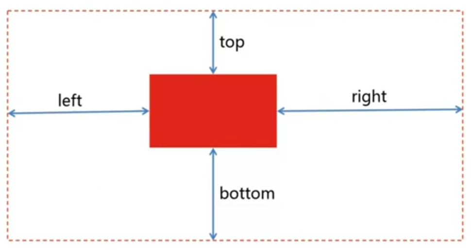

其用于设置元素边缘与参照物边缘的距离，且设置的值可为负值。在同时设置相对方向时，元素将被拉伸。

##### z-index

其用于设置 Z 轴上得排序，默认值为 0 但可设置为负值。（如不做设置，则按照文档流的顺序排列。后面的元素将置于前面的元素之上）

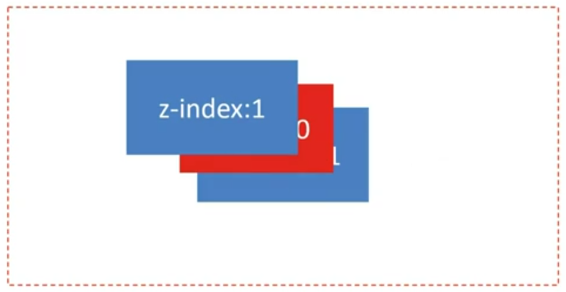

###### z-index 栈

父类容器的 `z-index` 优于子类 `z-index` 如图

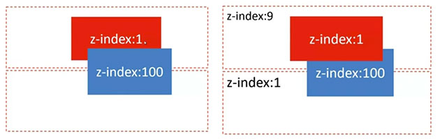

#### float

其可实现块级元素同行显示并存在于文档流之中。

```
float: left | right | none | inherit
```

- 默认宽度为内容宽度
- 脱离文档流（会被父元素边界阻挡与`position`脱离文档流的方式不同）
- 指的方向一直移动


**float 元素在同一文档流中**，当同时进行 `float` 时它们会按照文档流中的顺序排列。(当所有父元素中的所有元素脱离文档流之后，父元素将失去原有默认的内容高度)


**float 元素是半脱离文档流的**，对元素是脱离文档流，但对于内容则是在文档流之中的（既元素重叠但内容不重叠）。


##### clear

```
clear: both | left | right | none | inherit
```

- 应用于后续元素
- 应用于块级元素（block）

**使用方法**：

1. 浮动后续空白元素 `.emptyDiv {clear: both}`
1. clearfix 于父元素

```
/* clearfix */
.clearfix:after {
   content: "."; /* Older browser do not support empty content */
   visibility: hidden;
   display: block;
   height: 0;
   clear: both;
}
.clearfix {zoom: 1;} /* 针对 IE 不支持 :after */
```

#### flex


弹性布局可用于多行自适应，多列自适应，间距自适应和任意对齐。

**创建 flex container**

```
display: flex
/* 弹性容器内的均为弹性元素*/
```

**flex item**

只有弹性容器在文档流中的子元素才属于弹性元素。

```
<div style="display: flex;">
  <div>Block Element</div>
  <!-- flex item: YES-->
  <span>Inline Element</span>
  <!-- flex item: YES-->
  <div style="position:absolute;">Absolute Block Element</div>
  <!-- flex item: YES-->
</div>
```

##### flex 方向

###### flex-direction

```
<!-- 默认值为 row -->
flex-direction: row | row-reverse | column | column-reverse
```

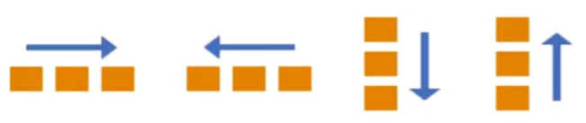

###### flex-wrap

```
<!-- 默认值为 nowrap -->
flex-wrap: nowrap | wrap | wrap-reverse
```


###### flex-flow

`flex-flow` 为 `flex-wrap` 与 `flex-direction` 的简写，建议使用此属性（避免同时使用两个属性来修改）。

```
flex-flow: <'flex-direction'> || <'flex-wrap'>
```


###### order

`order` 的值为相对的（同被设置和未被设置的值相比较），当均为设置时默认值为 0 则按照文档流中的顺序排列。

```
order: <integer>
<!-- 默认为 0 -->
```


##### flex 弹性

###### flex-basis

其用于设置 `flex-item` 的初始宽高（并作为弹性的基础）。如果 `flex-direction` 是以 `row` 排列则设置**宽**，如以 `column` 排列则设置**高**。

```
flex-basis: main-size | <width>
```

###### flex-grow

伸展因子，其为弹性布局中最重要的元素之一，`flex-grow` 设置元素可用空余空间的比例。`flex-container` 先安装宽度（`flex-basis`）进行布局，如果有空余空间就按照 `flex-grow` 中的比例进行分配。

**Width/Height = flex-basis + flex-grow/sum(flow-grow) * remain**

```
flex-grow: <number>
initial: 0
<!-- 默认值为 0 -->
```


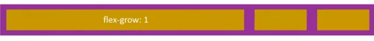


###### flex-shrink

收缩因子，用于分配超出的负空间如何从可用空间中进行缩减。

```
flex-shrink: <number>
initial: 1
<!-- 默认值为 1 -->
```

**Width/Height = flex-basis + flow-shrink/sum(flow-shrink) * remain**

remain 为负值，既超出的区域。


###### flex

其为 `flex-grow` `flex-shrink` `flex-basis` 的值缩写。

```
flex: <'flex-grow'> || <'flex-shrink'> || <'flex-basis'>
initial: 0 1 main-size
```

##### flex 对齐

###### justify-content

其用于设置主轴（main-axis）上的对其方式。弹性元素根据主轴（横向和纵向均可）定位所以不可使用 `left` 与 `right` 因为位置为相对的。（行为相似的属性有 `text-align`）

```
justify-content: flex-start | flex-end | center | space-between | space-around
<!-- 默认值为 flex-start -->
```

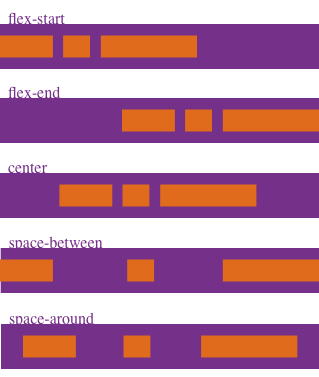

###### align-items

其用于设置副轴（cross-axis）上的对其方式。（行为相似的属性有 `vertical-align`）

```
align-items: flex-start | flex-end | center | baseline | stretch
<!-- 默认值为 stretch -->
```


###### align-self

其用于设置单个 `flex-item` 在 cross-axis 方向上的对其方式。

```
align-self: auto | flex-start | flex-end | center | baseline | stretch
<!-- 默认值为 auto -->
```


###### align-content

其用于设置 cross-axis 方向上的对其方式。

```
align-content:flex-start | flex-end | center | space-between | space-around | stretch
<!-- 默认为 stretch -->
```


### 变形

#### 2D 变形

##### transform

`transform` 中可以写一个或多个方法。

```
trnasform: none | <transform-function>+
transform: none
<!-- 默认值为 none -->
transform: <transform-function>+

transform: translate(50%) rotate(45deg);
transform: rotate(45deg) transform(50%)
<!-- 变形函数顺序普通结果不同，原因是坐标位置发生了改变 -->
```

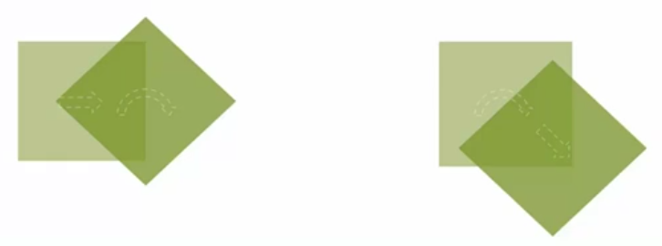

###### rotate()

```
rotate(<angle>)

rotate(45deg);
<!-- 右边旋转，顺时针 -->
rotate(-60deg);
<!-- 左边旋转，逆时针 -->
```


###### transform-origin

其用于设置原点的位置（默认位置为元素中心）第一值为 X 方向，第二值为 Y 方向， 第三值为 Z 方向。（当值空出未写的情况下默认为 50%）

```
transform-origin: [ <percentage> | <length> | left | center | right | top | bottom] | [ [ <percentage> | <length> | left | center | right ] && [ <percentage> | <length> | top | center | bottom ] ] <length>?

<!-- 默认值为 50% 50% -->

transform-origin: 50% 50%;
transform-origin: 0 0;
transform-origin: right 50px 20px;
transform-origin: top right 20px;
```

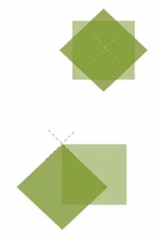

###### translate()

移动方法，参数分别代表 X 与 Y 轴的移动（偏移值均可为负值）。

```
translate(<translation-value>[, <translation-value>]?)

<!-- 也可单独设置 X 与 Y 轴的偏移 -->
translationX(<translation-value>)
translationY(<translation-value>)

transform: translate(50px);
transform: translate(50px, 20%);
<!-- Y 轴偏移为偏移对象的高度，X 轴为宽度 -->
transform: translate(-50px);
transform: translate(20%);
```


###### scale()

缩放方法，参数分别代表 X 与 Y 轴的缩放（缩放值均可为小数）。当第二值忽略时，默认设置为等同第一值。

```
scale(<number> [, <number>]?)

scaleX(<number>)
scaleY(<number>)

<!-- 整体放大 1.2 倍 -->
transform: scale(1.2);
<!-- 高度拉伸 -->
transform: scale(1, 1.2);
<!-- 宽度拉伸 -->
transform: scaleX(1.2);
<!-- 高度拉伸 -->
transform: scaleY(1.2);
```


###### skew()

其为倾斜的方法。第一值为 Y 轴往 X 方向倾斜（逆时针），第二值为 X 轴往 Y 方向倾斜（顺时针）。（倾斜值可为负值）

```
skew(<angle>[, <angle>]?)

skewX(<angle>)
skewY(<angle>)

transform: skew(30deg);
transform: skew(30deg, 30deg);
transform: skewX(30deg);
transform: skewY(30deg);
```


#### 3D 变形

##### rotateY()

3D 空间旋转。

```
transform: rotateY(<angle>)
```

##### perspective

其用于设置图片 Y 轴旋转后的透视效果。`<length>` 可以理解为人眼与元素之间的距离，越紧则效果越明显。

```
perspective: none | <length>

perspective: none;
perspective: 2000px;
perspective: 500px;
```


##### perspective-origin

其为设定透视的角度（透视位置均可设定为负值）。

```
perspective-origin: [ <percentage> | <length> | left | center | right | top | bottom] | [ [ <percentage> | <length> | left | center | right ] && [ <percentage> | <length> | top | center | bottom ] ]

perspective-origin: 50% 50%
<!-- 默认值为 50% 50% 正中间的位置进行透视-->
perspective-origin: left bottom;
perspective-origin: 50% -800px;
perspective-origin: right;
```

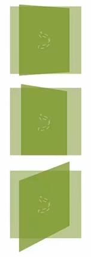

##### translate3d()

```
translate3d(<translate-value>, <translate-value>, <length>)

translateX(<translate-value>)
translateY(<translate-value>)
translateZ(<length>)

transform: translate3d(10px, 20%, 50px);
<!-- %的参照物为自身元素 -->
transform: translateX(10px);
transform: translateY(20%);
transform: translateZ(-100px);
```


##### scale3d()

```
scale3d(<number>, <number>, <number>)

scaleX(<number>)
scaleY(<number>)
scaleZ(<number>)

transform: scale3d(1.2, 1.2, 1);
transform: scale3d(1, 1.2, 1);
transform: scale3d(1.2, 1, 1);
transform: scaleZ(5);
<!-- Z 轴的缩放扩大并不影响盒子大小 -->
```

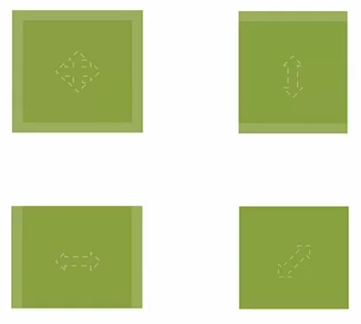

##### rotate3d()

取 X Y Z 三轴上的一点并于坐标原点连线，以连线为轴进行旋转（逆时针）。

```
rotate3d(<number>, <number>, <number>, <angle>)

rotateX(<angle>)
rotateY(<angle>)
rotateZ(<angle>)

transform: rotate3d(1, 0, 0, 45deg);
<!-- 上面等同于 X 轴旋转 -->
transform: rotate3d(0, 1, 0, 45deg);
<!-- 上面等同于 Y 轴旋转 -->
transform: rotate3d(0, 0, 1, 45deg);
<!-- 上面等同于 2D 旋转 -->
transform: rotate3d(1, 1, 1, 45deg);
```


##### transform-style

其用于设置保留内部的 3D 空间，原因是一个元素进行`transform`之后内部默认为`flat`。

```
transform-style: flat | perserve-3d

<!-- 默认为 flat -->

transform-style: flat;
transform-style: preserve-3d;
```


##### backface-visibility

其用于设置背面不可见。

```
backface-visibility: visible | hidden

backface-visibility: visible;
backface-visibility: hidden;
```


### 动画

#### transition

其为众多 `<single-transition>` 的值缩写。（当两个时间同时出现是，第一个时间为动画长度，第二个时间为动画延时）

```
transition: <single-transition> [',' <single-transition>]*

<single-transition> = [none | <single-transition-property>] || <time> || <single-transition-timing-function> || <time>


transition: none;
transition: left 2s ease 1s, color 2s;
transition: 2s;
```

##### transition-property

```
transition-property: none | <single-traisition-property> [ ',' <single-transition-property>]*

<single-transition-property> = all | <IDENT>

transition-property: none;
<!-- 默认值为 none -->
transition-property: all;
transition-property: left;
transition-property: left, color;
```

##### transition-duration

```
transition-duration: <time>[, <time>]*

transition-duration: 0s;
transition-duration: 1s;
transition-duration: 1s, 2s, 3s;
```

##### transition-delay

```
transition-delay: <time>[,<time>]*

transition-delay: 0s;
transition-delay: 1s;
transition-delay: 1s, 2s, 3s;
```

##### transition-timing-function

```
transition-timing-function: <single-transition-timing-function>[',' <single-transition-timing-function>]*

<!-- 默认函数为 ease -->
<single-transition-timing-function> = ease | linear | ease-in | ease-out | ease-in-out | cubic-bezier(<number>,<number>,<number>,<number>) | step-start | step-end | steps(<integer>)[, [start | end]]?)

<!-- 对于 cubic-bezier 的曲线，前两个值为 P1 的坐标，后两值为 P2 的坐标 -->

transition-timing-function: ease;
transition-timing-function: cubic-bezier(0.25, 0.1, 0.25, 1);
transition-timing-function: linear;
transition-timing-function: cubic-bezier(0, 0, 1, 1);
```

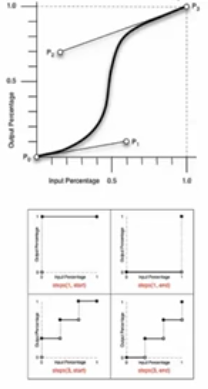

#### animation

```
animation: <single-animation> [',' <single-animation>]*

<single-animation> = <single-animation-name> || <time> || <single-animation-timing-function> || <time> || <single-animation-iteration-count> || <single-animation-direction> || <single-animation-fill-mode> || single-animation-play-state>

animation: none;
animation: abc 2s ease 0s 1 normal none running;
animation: abc 2s;
animation: abc 1s 2s both, abcd 2s both;
<!-- 调用多个动画 -->
```

动画可自动运行，但`transition`需要触发。

##### animation-name

`animation-name` 的名字可自由定义。

```
animation-name: <single-animation-name>#

<single-animation-name> = none | <IDENT>

animation-name: none;
animation-name: abc;
animation-name: abc, abcd;
```

##### animation-duration

与 `transition-duration` 属性值类似。

```
animation-duration: <time>[, <time>]*

animation-duration: 0s;
animation-duration: 1s;
animation-duration: 1s, 2s, 3s;
```

##### animation-timing-function

其与之前的 `transition-timing-function` 完全一模一样。

```
animation-timing-function: <timing-function>#

<single-timing-function> = <single-transition-timing-function>

animation-timing-function: ease;
animation-timing-function: cubic-bezier(0.25, 0.1, 0.25, 1);
animation-timing-function: linear;
animation-timing-function: cubic-bezier(0, 0, 1, 1);
animation-timing-function: ease, linear;
```

##### animation-iteration-count

其用于动画执行的次数（其默认值为 1）。

```
animation-iteration-count: <single-animation-iteration-count>#

<single-animation-iteration-count> = infinite | <number>

animation-iteration-count: 1;
animation-iteration-count: infinite;
animation-iteration-count: 1, 2, infinite;
```

##### animation-direction

其用于定义动画的运动方向。

```
animation-direction:<single-animation-direction>#

<single-animation-direction> = normal | reverse | alternate | alternate-revers

animation-direction: reverse
<!-- 动画相反帧的播放 -->
animation-direction: alternate
<!-- 往返执行动画 -->
animation-direction: alternate-revers
<!-- 相反的往返动画 -->
```

##### animation-play-state

其用于设定动画的播放状态。

```
animation-play-state: <single-animation-play-state>#

<single-animation-play-state> = running | paused

animation-play-state: running;
animation-play-state: pasued;
animation-play-state: running, paused;
```

##### animation-delay

其用于设置动画的延时，同 `transition-delay` 值相同。

```
animation-delay: <time>[, <time>]*
anim
animation-delay: 0s;
animation-delay: 1s;
animation-delay: 1s, 2s, 3s;
```

##### animation-fill-mode

其用于设置动画开始时，是否保持第一帧的动画和动画在结束时时候保持最后的状态。

```
animation-fill-mode: <single-animation-fill-mode>[',' <single-animation-fill-mode>]*

<single-animation-fill-mode> = none | backwards | forwards | both

animation-fill-mode: none;
<!-- 不做设置 -->
animation-fill-mode: backwards;
<!-- 动画开始时出现在第一帧的状态 -->
animation-fill-mode: forwards;
<!-- 动画结束时保留动画结束时的状态 -->
animation-fill-mode: both;
<!-- 开始和结束时都应保留关键帧定义的状态（通常设定） -->
animation-fill-mode: forwards, backwards;
```

##### @keyframes

其用于定义关键帧。

```
<!-- 写法一 -->
@keyframes abc {
  from {opacity: 1; height: 100px;}
  to {opacity: 0.5; height: 200px;}
}

<!-- 写法二 -->
@keyframes abcd {
  0% {opacity: 1; height: 100px;}
  100% {opacity: 0.5; height: 200px}
}

@keyframes flash {
  0%, 50%, 100% {opacity: 1;}
  25%, 75% {opacity: 0;}
}

<!-- 例子 -->
animation: abc 0.5s both;
animation: flash 0.5s both;
animaiton: abc 0.5s both, flash 0.5s both;
```


<a rel="license" href="http://creativecommons.org/licenses/by-nc-sa/4.0/"></a><br />This work by <a xmlns:cc="http://creativecommons.org/ns#" href="li-xinyang.com" property="cc:attributionName" rel="cc:attributionURL">Li Xinyang</a> is licensed under a <a rel="license" href="http://creativecommons.org/licenses/by-nc-sa/4.0/">Creative Commons Attribution-NonCommercial-ShareAlike 4.0 International License</a>.