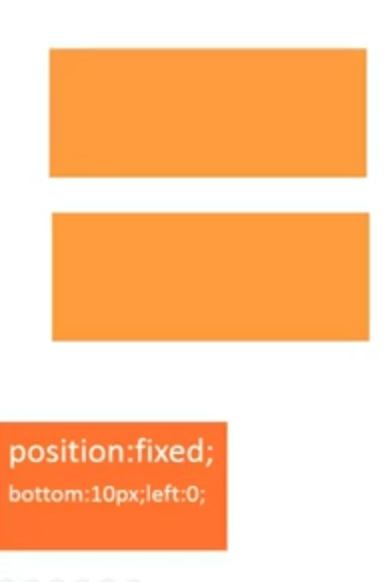

<!-- START doctoc generated TOC please keep comment here to allow auto update -->
<!-- DON'T EDIT THIS SECTION, INSTEAD RE-RUN doctoc TO UPDATE -->
**Table of Contents**  *generated with [DocToc](https://github.com/thlorenz/doctoc)*

- [CSS](#css)
  - [简介](#%E7%AE%80%E4%BB%8B)
  - [语法](#%E8%AF%AD%E6%B3%95)
    - [浏览器私有属性](#%E6%B5%8F%E8%A7%88%E5%99%A8%E7%A7%81%E6%9C%89%E5%B1%9E%E6%80%A7)
    - [属性值语法](#%E5%B1%9E%E6%80%A7%E5%80%BC%E8%AF%AD%E6%B3%95)
      - [基本元素](#%E5%9F%BA%E6%9C%AC%E5%85%83%E7%B4%A0)
      - [组合符号](#%E7%BB%84%E5%90%88%E7%AC%A6%E5%8F%B7)
      - [数量符号](#%E6%95%B0%E9%87%8F%E7%AC%A6%E5%8F%B7)
    - [@规则语法](#@%E8%A7%84%E5%88%99%E8%AF%AD%E6%B3%95)
      - [@规则](#@%E8%A7%84%E5%88%99)
  - [选择器](#%E9%80%89%E6%8B%A9%E5%99%A8)
    - [简单选择器](#%E7%AE%80%E5%8D%95%E9%80%89%E6%8B%A9%E5%99%A8)
      - [标签选择器](#%E6%A0%87%E7%AD%BE%E9%80%89%E6%8B%A9%E5%99%A8)
      - [类选择器](#%E7%B1%BB%E9%80%89%E6%8B%A9%E5%99%A8)
      - [id 选择器](#id-%E9%80%89%E6%8B%A9%E5%99%A8)
      - [通配符选择器](#%E9%80%9A%E9%85%8D%E7%AC%A6%E9%80%89%E6%8B%A9%E5%99%A8)
      - [属性选择器](#%E5%B1%9E%E6%80%A7%E9%80%89%E6%8B%A9%E5%99%A8)
      - [伪类选择器](#%E4%BC%AA%E7%B1%BB%E9%80%89%E6%8B%A9%E5%99%A8)
    - [其他选择器](#%E5%85%B6%E4%BB%96%E9%80%89%E6%8B%A9%E5%99%A8)
      - [伪元素选择器](#%E4%BC%AA%E5%85%83%E7%B4%A0%E9%80%89%E6%8B%A9%E5%99%A8)
      - [组合选择器](#%E7%BB%84%E5%90%88%E9%80%89%E6%8B%A9%E5%99%A8)
      - [选择器分组](#%E9%80%89%E6%8B%A9%E5%99%A8%E5%88%86%E7%BB%84)
    - [继承、优先、层级](#%E7%BB%A7%E6%89%BF%E3%80%81%E4%BC%98%E5%85%88%E3%80%81%E5%B1%82%E7%BA%A7)
      - [继承](#%E7%BB%A7%E6%89%BF)
      - [优先](#%E4%BC%98%E5%85%88)
        - [改变优先级](#%E6%94%B9%E5%8F%98%E4%BC%98%E5%85%88%E7%BA%A7)
      - [层叠](#%E5%B1%82%E5%8F%A0)
  - [文本](#%E6%96%87%E6%9C%AC)
    - [字体](#%E5%AD%97%E4%BD%93)
      - [改变字号](#%E6%94%B9%E5%8F%98%E5%AD%97%E5%8F%B7)
      - [改变字体](#%E6%94%B9%E5%8F%98%E5%AD%97%E4%BD%93)
      - [加粗字体](#%E5%8A%A0%E7%B2%97%E5%AD%97%E4%BD%93)
      - [倾斜字体](#%E5%80%BE%E6%96%9C%E5%AD%97%E4%BD%93)
      - [更改行距](#%E6%9B%B4%E6%94%B9%E8%A1%8C%E8%B7%9D)
      - [font shorthand](#font-shorthand)
      - [改变文字颜色](#%E6%94%B9%E5%8F%98%E6%96%87%E5%AD%97%E9%A2%9C%E8%89%B2)
    - [对齐方式](#%E5%AF%B9%E9%BD%90%E6%96%B9%E5%BC%8F)
      - [文字居中](#%E6%96%87%E5%AD%97%E5%B1%85%E4%B8%AD)
      - [文本垂直对齐](#%E6%96%87%E6%9C%AC%E5%9E%82%E7%9B%B4%E5%AF%B9%E9%BD%90)
      - [文本缩进](#%E6%96%87%E6%9C%AC%E7%BC%A9%E8%BF%9B)
    - [格式处理](#%E6%A0%BC%E5%BC%8F%E5%A4%84%E7%90%86)
      - [保留空格格式](#%E4%BF%9D%E7%95%99%E7%A9%BA%E6%A0%BC%E6%A0%BC%E5%BC%8F)
      - [文字换行](#%E6%96%87%E5%AD%97%E6%8D%A2%E8%A1%8C)
    - [文本装饰](#%E6%96%87%E6%9C%AC%E8%A3%85%E9%A5%B0)
      - [文字阴影](#%E6%96%87%E5%AD%97%E9%98%B4%E5%BD%B1)
      - [文本装饰（下划线等）](#%E6%96%87%E6%9C%AC%E8%A3%85%E9%A5%B0%EF%BC%88%E4%B8%8B%E5%88%92%E7%BA%BF%E7%AD%89%EF%BC%89)
    - [高级设置](#%E9%AB%98%E7%BA%A7%E8%AE%BE%E7%BD%AE)
      - [省略字符](#%E7%9C%81%E7%95%A5%E5%AD%97%E7%AC%A6)
      - [更换鼠标形状](#%E6%9B%B4%E6%8D%A2%E9%BC%A0%E6%A0%87%E5%BD%A2%E7%8A%B6)
      - [强制继承](#%E5%BC%BA%E5%88%B6%E7%BB%A7%E6%89%BF)
  - [盒模型](#%E7%9B%92%E6%A8%A1%E5%9E%8B)
    - [属性](#%E5%B1%9E%E6%80%A7)
      - [width](#width)
      - [height](#height)
      - [padding](#padding)
      - [margin](#margin)
        - [margin 合并](#margin-%E5%90%88%E5%B9%B6)
      - [border](#border)
      - [border-radius](#border-radius)
      - [overflow](#overflow)
      - [box-sizing](#box-sizing)
      - [box-shadow](#box-shadow)
      - [outline](#outline)
    - [TRBL](#trbl)
    - [值缩写](#%E5%80%BC%E7%BC%A9%E5%86%99)
  - [背景](#%E8%83%8C%E6%99%AF)
    - [background-color](#background-color)
    - [background-image](#background-image)
    - [background-repeat](#background-repeat)
    - [background-attachment](#background-attachment)
    - [background-position](#background-position)
      - [Sprite 的使用](#sprite-%E7%9A%84%E4%BD%BF%E7%94%A8)
    - [linear-gradient](#linear-gradient)
    - [radial-gradient](#radial-gradient)
    - [repeat-*-gradient](#repeat--gradient)
    - [background-origin](#background-origin)
    - [background-clip](#background-clip)
    - [background-size](#background-size)
    - [background shorthand](#background-shorthand)
  - [布局](#%E5%B8%83%E5%B1%80)
    - [display](#display)
      - [display:block](#displayblock)
      - [display:inline](#displayinline)
      - [display:inline-block](#displayinline-block)
      - [display:none](#displaynone)
    - [position](#position)
      - [position:relative](#positionrelative)
      - [position:absolute](#positionabsolute)
      - [position:fixed](#positionfixed)
      - [top/right/bottom/left](#toprightbottomleft)
      - [z-index](#z-index)
        - [z-index 栈](#z-index-%E6%A0%88)
    - [float](#float)
      - [clear](#clear)
    - [flex](#flex)
      - [flex 方向](#flex-%E6%96%B9%E5%90%91)
        - [flex-direction](#flex-direction)
        - [flex-wrap](#flex-wrap)
        - [flex-flow](#flex-flow)
        - [order](#order)
      - [flex 弹性](#flex-%E5%BC%B9%E6%80%A7)
        - [flex-basis](#flex-basis)
        - [flex-grow](#flex-grow)
        - [flex-shrink](#flex-shrink)
        - [flex](#flex-1)
      - [flex 对齐](#flex-%E5%AF%B9%E9%BD%90)
        - [justify-content](#justify-content)
        - [align-items](#align-items)
        - [align-self](#align-self)
        - [align-content](#align-content)
  - [变形](#%E5%8F%98%E5%BD%A2)
    - [2D 变形](#2d-%E5%8F%98%E5%BD%A2)
      - [transform](#transform)
        - [rotate()](#rotate)
        - [transform-origin](#transform-origin)
        - [translate()](#translate)
        - [scale()](#scale)
        - [skew()](#skew)
    - [3D 变形](#3d-%E5%8F%98%E5%BD%A2)
      - [rotateY()](#rotatey)
      - [perspective](#perspective)
      - [perspective-origin](#perspective-origin)
      - [translate3d()](#translate3d)
      - [scale3d()](#scale3d)
      - [rotate3d()](#rotate3d)
      - [transform-style](#transform-style)
      - [backface-visibility](#backface-visibility)
  - [动画](#%E5%8A%A8%E7%94%BB)
    - [transition](#transition)
      - [transition-property](#transition-property)
      - [transition-duration](#transition-duration)
      - [transition-delay](#transition-delay)
      - [transition-timing-function](#transition-timing-function)
    - [animation](#animation)
      - [animation-name](#animation-name)
      - [animation-duration](#animation-duration)
      - [animation-timing-function](#animation-timing-function)
      - [animation-iteration-count](#animation-iteration-count)
      - [animation-direction](#animation-direction)
      - [animation-play-state](#animation-play-state)
      - [animation-delay](#animation-delay)
      - [animation-fill-mode](#animation-fill-mode)
      - [@keyframes](#@keyframes)

<!-- END doctoc generated TOC please keep comment here to allow auto update -->

## CSS

### 简介

CSS (Cascading Stylesheet) 它用于设置页面的表现。CSS3 并不是一个完整的独立版本而是将不同的功能拆分成独立模块（例如，选择器模块，盒模型模块），这有利于不同功能的及时更新与发布也利于浏览器厂商的实习。


**CSS 引入方法**
```html
// 外部样式表
<head>
  <link rel="stylesheet" type="text/css" href="style.css">
</head>

// 内部样式表
<head>
  <style type="text/css">
    p {
      margin: 10px;
    }
  </style>
</head>

// 内嵌样式(可在动态效果中同 JavaScript 一同使用)
<p style="color: red">Sample Text</p>
```

### 语法

```css
/* 选择器 */
.m-userlist {
  /* 属性声明 */
  margin: 0 0 30px;
  /* 属性名:属性值; */
}
.m-userlist .list {
  position: relative;
  height: 100px;
  overflow: hidden;
}
```

#### 浏览器私有属性

- Google Chrome, Safari (`-webkit`)
- Firefox (`-moz-`)
- IE (`-ms-`)
- Opera (`-o-`)

```css
.pic {
  -webkit-transform: rotate(-3deg);
  -ms-transform: rotate(-3deg);
  transform: rotate(-3deg);
}
```

NOTE: 使用 [http://pleeease.io/play/](http://pleeease.io/play/) ，CSS 预处理器（Sass，Less，Stylus）或编辑器插件可自动添加浏览器厂商的私有属性前缀。

#### 属性值语法

```css
margin: [ <length> | <percentage> | auto ]{1,4}
/* 基本元素：<length>, <percentage>, auto*/
/* 组合符号：[], | */
/* 数量符号：{1,4} */
```

##### 基本元素

**关键字**
- auto
- solid
- bold
- ...

**类型**
- 基本类型
    - `<length>`
    - `<percentage>`
    - `<color>`
    - ...
- 其他类型
    - <'padding-width'>
    - <'color-stop'>
- 符号
    - `/`
    - ','
- inherit, initial

##### 组合符号

- `<'font-size'> <'font-family'>` （` ` 两项必存，顺序毕遵）
    - 合法：`12px arial`
    - 不合法：`2em`
    - 不合法：`arial 14px`
- `<length>&&<color>` (`&&` 两项必存，顺序无碍)
    - 合法：green 2px
    - 合法：1em orange
    - 不合法：blue
- `underline || overline || line-through || blink` (`||` 至少选一，顺序无碍)
    - 合法：underline
    - 合法：overline underline
- `<color> | transparent`（`|` 只可选一，不可共存）
    - 合法：orange
    - 合法：transparent
    - 不合法：orange transparent
- `bold [thin || <length>]`（`[]` 分组之用，视为整体）
    - 合法：bold thin
    - 合法：bold 2em

##### 数量符号

- `<length>`（无则表示仅可出现一次）
    - 合法：1px
    - 合法：10em
    - 不合法：1px 2px
- `<color-stop>[, <color-stop>]+` (`+` 可出现一次或多次)
    - 合法：#fff, red
    - 合法：blue, green 50%, gray
    - 不合法：red
- `inset?&&<color>` (`?` 表示可选)
    - 合法：inset orange
    - 合法：red
- `<length>{2,4}` (`{2,4}` 可出现次数和最少最多出现次数)
    - 合法：1px 2px
    - 合法：1px 2px 3px
    - 不合法: 1px
    - 不合法：1px 2px 3px 4px 5px
- `<time>[, <time>]*`（`*` 出现 0 次或多次）
    - 合法：1s
    - 合法：1s,4ms
- `<time>#`（`#` 出现一次或者多次，用`,`分隔）
    - 合法：2s, 4s
    - 不合法：1s 2s

**CSS 规则示例**


#### @规则语法

```
@import "subs.css";
@charset "utf-8";
@media print {
  /* property: value */
}
@keyframes fadein {
  /* property: value */
}
```

- `@标示符 内容;`
- `@标示符 内容{}`

##### @规则

**常用的规则**
- `@media` （用于响应式布局）
- `@keyframes` （CSS 动画的中间步骤）
- `@font-face` （引入外部字体）

**其他规则**（不常用）
- `@import`
- `@charset`
- `@namespace`
- `@page`
- `@supports`
- `@document`

### 选择器

<p data-height="268" data-theme-id="15197" data-slug-hash="mJmwdK" data-default-tab="result" data-user="li-xinyang" class='codepen'>See the Pen <a href='http://codepen.io/li-xinyang/pen/mJmwdK/'>FEND_Selectors</a> by Li Xinyang (<a href='http://codepen.io/li-xinyang'>@li-xinyang</a>) on <a href='http://codepen.io'>CodePen</a>.</p>
<script async src="//assets.codepen.io/assets/embed/ei.js"></script>

选择器可被看做表达式，通过它可以选择相应的元素并应用不同的样式。

- 简单选择器
- 元素选择器
- 组合选择器

#### 简单选择器

简单选择器可组合使用。

##### 标签选择器

```html
<div>
  <p>Sample Paragraph</p>
  <p>Sample Paragraph</p>
  <p>Sample Paragraph</p>
</div>

<style type="text/css">
  p {
    color: blue;
  }
</style>
```

##### 类选择器

`.className` 以 `.` 开头，名称可包含字母，数字，`-`，`_`，但必须以字母开头。它区分大小写并可出现多次。

```html
<div>
  <p>Sample Paragraph</p>
  <p class="special bold">Sample Paragraph</p>
  <p>Sample Paragraph</p>
</div>

<style type="text/css">
  p {
    color: blue
  }
  .special {
    color: orange;
  }
  .bold {
    font-weight: bold;
  }
</style>
```

##### id 选择器

`#idName` 以 `#` 开头且只可出现**一次**，其命名要求于 `.className` 相同。

```html
<div>
  <p id="special">Sample Paragraph</p>
</div>

<style type="text/css">
  #special {
    color: red;
  }
</style>
```

##### 通配符选择器

```html
<div>
  <p>Sample Paragraph</p>
  <p>Sample Paragraph</p>
</div>

<style type="text/css">
  * {
    color: blue;
  }
</style>
```

##### 属性选择器

`[attr]` 或 `[attr=val]` 来选择相应的元素。`#nav{...}` 既等同于 `[id=nav]{...}`。IE7+

`[attr~=val]` 可选用与选择包含 `val` 属性值的元素，像`class="title sports"` 与 `class="sports"`。`.sports{...}` 既等同于 `[class~=sports]{...}` IE7+

`[attr|=val]` 可以选择`val`开头及开头紧接`-`的属性值。IE7+

`[attr^=val]` 可选择以`val`开头的属性值对应的元素，如果值为符号或空格则需要使用引号 `""`。IE7+

`[attr$=val]` 可选择以`val`结尾的属性值对应的元素。IE7+

`[attr*=val]` 可选择以包含`val`属性值对应的元素。IE7+

```html
<div>
  <form action="">
    <input type="text" value="Xinyang" disabled>
    <input type="password" placeholder="Password">
    <input type="button" value="Button">
  </form>
</div>
<style type="text/css">
  [disabled] {
    background-color: orange;
  }
  [type=button] {
    color: blue;
  }
</style>
```

##### 伪类选择器

**常用伪类选择器**：
- `:link` IE6+
- `:visited` IE7+
- `:hover` IE6中仅可用于链接
- `:active` IE6/7中仅可用于链接
- `:enabled` IE9+
- `:disabled` IE9+
- `:checked` IE9+
- `:first-child` IE8+
- `:last-child` IE9+
- `:nth-child(even)` 可为 `odd` `even` 或数字 IE9+
- `:nth-last-child(n)` `n`从 0 开始计算 IE9+
- `:only-child` 仅选择唯一的元素 IE9+
- `:only-of-type` IE9+
- `:first-of-type` IE9+
- `:last-of-type` IE9+
- `:nth-of-type(even)` IE9+
- `:nth-last-of-type(2n)` IE9+

**不常用伪类选择器**：
- `:empty` 选中页面中无子元素的标签 IE9+
- `:root` 选择 HTML 根标签 IE9+
- `:not()` 参数为一般选择器 IE9+
- `:target` 被锚点选中的目标元素 IE9+
- `:lang()` 选中语言值为某类特殊值的元素 IE7+

NOTE：请在使用时查找文档

```html
<div>
  <a href="http://sample-site.com" title="Sample Site">Sample Site</a>
</div>
<style type="text/css">
  /* 伪类属性定义有顺序要求！ */
  a:link {
    color: gray;
  }
  a:visited {
    color:red;
  }
  a:hover {
    color: green;
    /* 鼠标悬停 */
  }
  a:active {
    color: orange;
    /* 鼠标点击 */
  }
</style>
```

#### 其他选择器

##### 伪元素选择器

注意与伪类学则器的区分。

- `::first-letter` IE6+
- `::first-line` IE6+
- `::before{content: "before"}` 需与 `content` 一同使用 IE8+
- `::after{content: "after"}` 需与 `content` 一同使用 IE8+
- `::selection` 被用户选中的内容（鼠标选择高亮属性）IE9+ Firefox需用 `-moz` 前缀

##### 组合选择器

- 后代选择器 `.main h2 {...}`，使用` `表示 IE6+
- 子选择器 `.main>h2 {...}`，使用`>`表示 IE7+
- 兄弟选择器 `h2+p {...}`，使用`+`表示 IE7+
    - `h2~p {...}`，使用`~`表示（此标签无需紧邻）IE7+

##### 选择器分组

```html
<style type="text/css">
/* 下面两组样式声明效果一致 */
h1 {color: red;}
h2 {color: red;}
h3 {color: red;}

h1, h2, h3 {color: red;}
</style>
```

#### 继承、优先、层级

##### 继承

子元素继承父元素的样式，但并不是所有属性都是默认继承的。通过文档中的 `inherited: yes` 来判断属性是否可以自动继承。


自动继承属性：
- color
- font
- text-align
- list-style
- ...

非继承属性：
- background
- border
- position
- ...

##### 优先

CSS Specificity Calculator 可以在[这里](http://specificity.keegan.st/)找到。更多关于 CSS 优先级别的信息可以在[这里](https://css-tricks.com/specifics-on-css-specificity/)找到（英文）。

计算方法：
- a = 行内样式
- b = id 选择器的数量
- c = 类、伪类的属性选择器的数量
- d = 标签选择器和伪元素选择器的数量

NOTE：从上到下优先级一次降低，且优先级高的样式会将优先级低的样式覆盖。大致公式（并不准确）如下。

```
value = a * 1000 + b * 100 + c * 10 + d
```

###### 改变优先级

- 改变样式声明先后顺序
- 提升选择器优先级
- `!important`（慎用）

##### 层叠

层叠为相同属性根据优先级覆盖，如优先级相同则后面会覆盖前面的属性，而不同属性则会合并。

### 文本

<p data-height="268" data-theme-id="15197" data-slug-hash="mJmwej" data-default-tab="result" data-user="li-xinyang" class='codepen'>See the Pen <a href='http://codepen.io/li-xinyang/pen/mJmwej/'>FEND_Fonts</a> by Li Xinyang (<a href='http://codepen.io/li-xinyang'>@li-xinyang</a>) on <a href='http://codepen.io'>CodePen</a>.</p>
<script async src="//assets.codepen.io/assets/embed/ei.js"></script>

#### 字体

##### 改变字号

`font-size: <absolute-size> | <relative-size> | <length> | <percentage> | inherit`

- `<absolute-size>` 有 small large medium
- `<relative-size>` 有 smaller larger

```stylus
div
  font-size 12px
  p#sample0
    font-size 16px
  p#sample1
    font-size 2em
  p#sample2
    font-size 200%
```

NOTE：以上两值在开发中并不常用。`2em` 与 `200%` 都为父元素默认大小的两倍（参照物为父元素的字体大小 `12px`）。

##### 改变字体

`font-family: [ <family-name> | <generic-family> ]# `

`<generic-family>` 可选选项，但具体使用字体由浏览器决定
- serif
- sans-serif
- cursive
- fantasy
- monospace

```css
font-family: arial, Verdana, sans-serif;
```

NOTE：优先使用靠前的字体

##### 加粗字体

`font-weight: normal | bold | bolder | lighter | 100 | 200 | 300 | 400 | 500 | 600 | 700 | 800 | 900`

```css
font-weight: normal;
font-weight: bold;
```

##### 倾斜字体

`font-style: normal | italic | oblique | inherit`

`italic` 使用字体中的斜体，而 `oblique` 在没有斜体字体时强制倾斜字体。

##### 更改行距

`line-height: normal | <number> | <length> | <percentage>`

`normal` 值为浏览器决定，在1.1至1.2之间（通常设置值为1.14左右）

```css
/* length 类型 */
line-height: 40px;
line-height: 3em;
/* percentage 类型 */
line-height: 300%;
/* number 类型 */
line-height: 3;
```

NOTE：当`line-height`为 `number` 类型时，子类直接继承其数值（不计算直接继承）。而当为 `percentage` 类型时，子类则会先计算再显示（先计算后继承）。

##### font shorthand

`font: [ [ <‘font-style’> || <font-variant-css21> || <‘font-weight’> || <‘font-stretch’> ]? <‘font-size’> [ / <‘line-height’> ]? <‘font-family’> ] | caption | icon | menu | message-box | small-caption | status-bar`

```css
font: 30px/2 "Consolas", monospace;
font: italic bold 20px/1.5 arial, serif;
font: 20px arial, serif;
```

NOTE：当其他值为空时，均被设置为默认值。

##### 改变文字颜色

`color: <color>`

```css
element { color: red; }
element { color: #f00; }
element { color: #ff0000; }
element { color: rgb(255,0,0); }
element { color: rgb(100%, 0%, 0%); }
element { color: hsl(0, 100%, 50%); }

/* 50% translucent */
element { color: rgba(255, 0, 0, 0.5); }
element { color: hsla(0, 100%, 50%, 0.5); }

/* 全透明 */
element { color: transparent' }
element { color: rgba(0, 0, 0, 0); }
```

#### 对齐方式

##### 文字居中

`text-align: start | end | left | right | center | justify | match-parent | start end`

NOTE：默认为文本左对齐。

##### 文本垂直对齐

`vertical-align: baseline | sub | super | text-top | text-bottom | middle | top | bottom | <percentage> | <length>`

NOTE：`<percentage>`的参照物为`line-height`

##### 文本缩进

`text-indent: <length> | <percentage> && [ hanging || each-line ]`

NOTE：缩进两个字可使用 `text-indent: 2em;`

#### 格式处理

##### 保留空格格式

`white-space: normal | pre | nowrap | pre-wrap | pre-line`

`pre` 行为同 `<pre>` 一致。

<table class="standard-table">
 <thead>
  <tr>
   <th>&nbsp;</th>
   <th>New lines</th>
   <th>Spaces and tabs</th>
   <th>Text wrapping</th>
  </tr>
 </thead>
 <tbody>
  <tr>
   <th><code>normal</code></th>
   <td>Collapse</td>
   <td>Collapse</td>
   <td>Wrap</td>
  </tr>
  <tr>
   <th><code>nowrap</code></th>
   <td>Collapse</td>
   <td>Collapse</td>
   <td>No wrap</td>
  </tr>
  <tr>
   <th><code>pre</code></th>
   <td>Preserve</td>
   <td>Preserve</td>
   <td>No wrap</td>
  </tr>
  <tr>
   <th><code>pre-wrap</code></th>
   <td>Preserve</td>
   <td>Preserve</td>
   <td>Wrap</td>
  </tr>
  <tr>
   <th><code>pre-line</code></th>
   <td>Preserve</td>
   <td>Collapse</td>
   <td>Wrap</td>
  </tr>
 </tbody>
</table>

##### 文字换行

`word-wrap: normal | break-word`

NOTE：允许长单词自动换行。

`word-break: normal | break-all | keep-all`

NOTE：`break-all` 单词中的任意字母间都可以换行。

#### 文本装饰

##### 文字阴影

`text-shadow:none | <shadow-t>#` 或 `text-shadow:none | [<length>{2,3}&&<color>?]#`

```css
p {
  text-shadow: 1px 1px 1px #000,
               3px 3px 5px blue;
}
```

1. value = The X-coordinate X 轴偏移像素
2. value = The Y-coordinate Y 轴偏移像素
3. value = The blur radius  阴影模糊半径
4. value = The color of the shadow 阴影颜色（默认为文字颜色）

##### 文本装饰（下划线等）

`text-decoration: <'text-decoration-line'> || <'text-decoration-style'> || <'text-decoration-color'>`

```css
h1.under {
    text-decoration: underline;
}
h1.over {
    text-decoration: overline;
}
p.line {
    text-decoration: line-through;
}
p.blink {
    text-decoration: blink;
}
a.none {
    text-decoration: none;
}
p.underover {
    text-decoration: underline overline;
}
```

#### 高级设置

##### 省略字符

`text-overflow: [ clip | ellipsis | <string> ]{1,2}`

```css
/* 常用配合 */
text-overflow: ellipsis;
overflow: hidden; /* 溢出截取 */
white-space: nowrap; /* 禁止换行 */
```

##### 更换鼠标形状

`cursor: [[<funciri>,]* [ auto | crosshair | default | pointer | move | e-resize | ne-resize | nw-resize | n-resize | se-resize | sw-resize | s-resize | w-resize| text | wait | help ]] | inherit`

**常用属性**

`cursor: [<uri>,]*[auto | default | none | help | pointer | zoom-in | zoom-out | move]`

- `<uri>` 图片资源地址代替鼠标默认形状
- `<default>` 默认光标
- `<none>` 隐藏光标
- `<pointer>` 手型光标
- `<zoom-in>`
- `<zoom-out>`
- `<move>`

```css
cursor: pointer;
cursor: url(image-name.cur), pointer;
/* 当 uri 失效时或者则会起作用 */
```

##### 强制继承

`inherit` 会强制继承父元素的属性值。

```css
font-size: inherit;
font-family: inherit;
font-weight: inherit;
...
word-wrap: inherit;
work-break: inherit
text-showdow: inherit
```

NOTE：具体在使用时可查询文档

### 盒模型

<p data-height="268" data-theme-id="15197" data-slug-hash="qdmPEE" data-default-tab="result" data-user="li-xinyang" class='codepen'>See the Pen <a href='http://codepen.io/li-xinyang/pen/qdmPEE/'>FEND_003_BoxModel</a> by Li Xinyang (<a href='http://codepen.io/li-xinyang'>@li-xinyang</a>) on <a href='http://codepen.io'>CodePen</a>.</p>
<script async src="//assets.codepen.io/assets/embed/ei.js"></script>

#### 属性


##### width

**内容盒子宽**

`width: <length> | <percentage> | auto | inherit`

NOTE：通常情况下百分比得参照物为元素的父元素。`max-width` 与 `min-width` 可以设置最大与最小宽度。

##### height

**内容盒子高**

`height: <length> | <percentage> | auto | inherit`

NOTE：默认情况元素的高度为内容高度。`max-height` 与 `min-height` 可以设置最大与最小高度。

##### padding


`padding: [<length> | <percentage>]{1,4} | inherit`

##### margin


`margin: [<length> | <percentage> | auto]{1,4} | inherit`

NOTE：`margin` 默认值为 `auto`

Trick：

```
/* 可用于水平居中 */
margin: 0 auto;
```

###### margin 合并


毗邻元素外间距（margin）会合并，既取相对较大的值。父元素与第一个和最后一个子元素的外间距也可合并。

##### border


```
border: [<br-width> || <br-style> || <color>] | inherit
border-width: [<length> | thin | medium | thick]{1,4} | inherit
border-style: [solid | dashed | dotted | ...]{1,4} |inherit
border-colro: [<color> | transparent]{1,4} | inherit
```

NOTE：`border-color` 默认为元素字体颜色。

##### border-radius


```
/* 水平半径/垂直半径 */
border-radius: [ <length> | <percentage> ]{1,4} [ / [ <length> | <percentage> ]{1,4} ]?
```

NOTE：四个角的分解属性由左上角顺时针附值。

##### overflow


`overflow: visible | hidden | scroll | auto`

NOTE：默认属性为 `visible`。使用 `overflow-x` 与 `overflow-y` 单独的设置水平和垂直方向的滚动条。

##### box-sizing


`box-sizing: content-box | border-box | inherit`

- `content-box` = 内容盒子宽高 + 填充（`Padding`）+ 边框宽（`border-width`）
- `border-box` = 内容盒子宽高

##### box-shadow


`box-shadown: none | [inset? && [ <offset-x> <offset-y> <blur-radius>? <spread-radius>? <color>? ] ]#`

```html
box-shadow: 4px  6px   3px  0px red;
             |    |     |    |
          水平偏移|     |    |
               垂直偏移 |    |
                    模糊半径 |
                          阴影大小
```

NOTE：水平与垂直偏移可以为负值即相反方向偏移。颜色默认为文字颜色。阴影不占据空间，仅为修饰效果。

##### outline

```
outline: [ <'outline-color'> || <'outline-style'> || <'outline-width'> ]
outline-width: <length> | thin | medium | thick | inherit
outline-style: solid | dashed | dotted | ... | inherit
outline-color: <color> | invert | inherit
/* invert 与当前颜色取反色 */
```

NOTE：`outline` 与 `border` 相似但无法分别设置四个方向的属性。`outline` 并不占据空间，而 `border` 占据空间，且显示位于 `border` 以外。

#### TRBL


TRBL (Top, Right, Bottom, Left) 即为顺时针从顶部开始。具有四个方向的属性都可以通过 `*-top` `*-right` `*-bottom` 与 `*-left` 单独对其进行设置。

#### 值缩写

下面的值缩写以 `padding` 为例。

> 对面相等，后者省略；四面相等，只设一个。

```html
/*      四面值 */
padding: 20px;
padding: 20px 20px 20px 20px;

/*      上下值 右左值 */
padding: 20px   10px;
padding: 20px 10px 20px 10px;

/*       上值 右左值 下值 */
padding: 20px 10px   30px;
padding: 20px 10px 30px 10px;
```

### 背景

#### background-color

```
background-color: <color>
background-color: #f00;
background-color: rgba(255, 0, 0, 0.5);
background-color: transparent; /* 默认值 */
```

#### background-image

```
background-image: <bg-image>[, <bg-image>]*
/* <bg-image> = <image> | none */
background-image: url("../image/pic.png");
background-image: url("../image/pic.png0"), url("../image/pic1.png");
/* 多张背景图时，先引入的图片在上一层后引入则在下一层 */
```

NOTE：当`background-color` 与 `background-image` 共存时，背景颜色永远在最底层（于背景图片之下）。

#### background-repeat

`background-repeat` 需与背景图片数量一致。

```
background-repeat: <repeat-style>[, <repeat-style]*
<repeat-style> = repeat-x | repeat-y | [repeat | space | round | no-repeat]{1,2}

/*                   X 轴     Y 轴 */
background-repeat: no-repeat repeat;
```

- `space` 平铺并在水平和垂直留有空隙，空隙的大小为图片均匀分布后完整覆盖显示区域的宽高
- `round` 不留空隙平铺且覆盖显示区域，图标会被缩放以达到覆盖效果（缩放不一定等比）

#### background-attachment

当页面内容超过显示区域时，使用 `local` 使背景图片同页面内容一同滚动。

```
background-attachment: <attachment>[, <attachment>]*
<attachment> = scroll | fixed | local
```

#### background-position

```
background-position: <position>[, <position>]*
<position> = [left|center|right|top|bottom|<percentage>|<length>]|[left|center|right|top|bottom|<percentage>|<length>] [left|center|right|top|bottom|<percentage>|<length>] | [center |[left|right][<percentage>|<length>]?]&&[center |[left|right][<percentage>|<length>]?]

/* 默认位置为 */
background-position: 0 0;

/* percentage 是容器与图片的百分比重合之处*/
background-position: 20% 50%;

/* 等同效果 */
background-position: 50% 50%;
background-position: center center;

background-position: 0 0;
background-position: left top;

background-position: 100% 100%;
background-position: right bottom;

/* 四个值时方向只为参照物 */
background-position: right 10px top 20px;
```


##### Sprite 的使用

```html
background-image: url(sprite.png)
background-repeat: no-repeat;
background-positon: 0 -100px
```

使用位置为负值将图片偏移使需要的图片位置上移并显示正确的图案。

#### linear-gradient

```
linear-gradient()
[[<angle> | to <side-or-corner],]? <color-step>[, <color-stop>]+
<side-or-corner> = [left | right] || [top | bottom]
<color-stop> = <color> [<percentage> | <length>]?

background-image: linear-gradient(red, blue);
background-image: linear-gradient(to top, red, blue);
background-image: linear-gradient(to right bottom, red, blue);
background-image: linear-gradient(0deg, red, blue);
background-image: linear-gradient(45deg, red, blue);
background-image: linear-gradient(red, green, blue);
background-image: linear-gradient(red, green 20%, blue);
```


#### radial-gradient

```
radial-gradient(   [ circle || <length> ] [ at <position> ]? , | [ ellipse || [<length> | <percentage> ]{2}] [ at <position> ]? , | [ [ circle | ellipse ] || <extent-keyword> ] [ at <position> ]? , | at <position> , <color-stop> [ , <color-stop> ]+ )

<extent-keyword> = closest-corner | closest-side | farthest-corner | farthest-side
<color-stop> = <color> [ <percentage> | <length> ]?

background-image: radial-gradient(cloest-side, red, blue);
background-image: radial-gradient(circle, red, blue);
background-image: radial-gradient(circle 100px, red, blue);
background-image: radial-gradient(red, blue);
background-image: radial-gradient(100px 50px, red, blue);
background-image: radial-gradient(100px 50px at 0 0, red, blue);
background-image: radial-gradient(red, green 20%, blue);
```


#### repeat-*-gradient

```
background-image: repeating-linear-gradient(red, blue 20px, red 40px);
background-image: repeating-radial-gradient(red, blue 20px, red 40px);
```


#### background-origin

**案例模型**


决定背景 (0,0) 坐标与 100% 坐标的区域。默认值为 `padding-box`。

```
<box>[, <box>]*
<box> = border-box | padding-box | content-box

background-image: url(red.png);
background-repeat: no-repeat;

background-origin: padding-box;
background-origin: border-box;
background-origin: content-box;
```


#### background-clip

裁剪背景，默认值为`border-box`。

```
<box>[, <box>]*
<box> = border-box | padding-box | content-box

background-image: url(red.png);
background-repeat: no-repeat;

background-clip: border-box;
background-clip: padding-box;
background-clip: content-box;
```


#### background-size

```
<bg-size>[, <bg-size>]*
<bg-size> = [<length> | <percentage> | auto] {1, 2} | cover | contain

background-image: url(red.png);
background-repeat: no-repeat;
background-position: 50% 50%;

background-size: auto;
background-size: 20px 20px;
/* % 参照物为容器*/
background-size: 50% 50%;
/* 尽可能小，但宽度与高度不小过容器（充满容器） */
background-size: cover;
/* 尽可能大，但宽度与高度不超过容器（最大完全显示）*/
background-size: contain;
```


#### background shorthand

```
[<bg-layer,]* <final-bg-layer>
<bg-layer> = <bg-image> || <position> [/ <bg-size>]? || <repeat-style> || <attachment> || <box> || <box>

/* 两个 <box> 第一个为 background-origin */
/* 两个 <box> 第二个为 background-clip */
/* 只出现一个 <box> 则即是 background-origin 也是 background-clip */

<final-bg-layer> = <bg-layer> || <'background-color'>

background: url(red.png) 0 0/20px 20px no-repeat, url(blue.png) 50% 50%/contain no-repeat content-box green;
```


### 布局

Firefox 布局可视化 **Gecko Reflow Visualisation**，布局是指浏览器将元素以正确的大小摆放在正确的位置上。

#### display

设置元素的显示方式

|display|默认宽度|可设置宽高|起始位置|
|-------|--------|----------|--------|
|block|父元素宽度|是|换行|
|inline|内容宽度|否|同行|
|inline-block|内容宽度|是|同行|

##### display:block

- 默认宽高为父元素宽高
- 可设置宽高
- 换行显示

##### display:inline

- 默认宽度为内容宽度
- 不可设置宽高
- 同行显示（元素内部可换行）

##### display:inline-block

- 默认宽度为内容宽度
- 可设置宽高
- 同行显示
- 整块换行

##### display:none

- 设置元素不显示

`display:none` 与 `visibility:hidden` 的区别为 `display:none` 不显示且不占位，但 `visibility:hidden` 不显示但占位。


#### position

`position` 用于设置定位的方式与`top` `right` `bottom` `left` `z-index` 则用于设置参照物位置（必须配合定位一同使用）。

```
position: static | relative | absolute | fixed
/* 默认值为 static */

```

##### position:relative

- 相对定位的元素仍在文档流之中，并按照文档流中的顺序进行排列。
- 参照物为元素本身的位置。

NOTE：最常用的目的为改变元素层级和设置为绝对定位的参照物。


##### position:absolute

- 默认宽度为内容宽度
- 脱离文档流
- 参照物为第一个定位祖先或根元素（HTML 元素）


##### position:fixed

- 默认宽度为内容宽度
- 脱离文档流
- 参照物为视窗

NOTE：宽高的100%的参照依然为视窗（例：网页遮罩效果）



##### top/right/bottom/left


其用于设置元素边缘与参照物边缘的距离，且设置的值可为负值。在同时设置相对方向时，元素将被拉伸。

##### z-index

其用于设置 Z 轴上得排序，默认值为 0 但可设置为负值。（如不做设置，则按照文档流的顺序排列。后面的元素将置于前面的元素之上）


###### z-index 栈

父类容器的 `z-index` 优于子类 `z-index` 如图


#### float

其可实现块级元素同行显示并存在于文档流之中。

```
float: left | right | none | inherit
```

- 默认宽度为内容宽度
- 脱离文档流（会被父元素边界阻挡与`position`脱离文档流的方式不同）
- 指的方向一直移动


**float 元素在同一文档流中**，当同时进行 `float` 时它们会按照文档流中的顺序排列。(当所有父元素中的所有元素脱离文档流之后，父元素将失去原有默认的内容高度)


**float 元素是半脱离文档流的**，对元素是脱离文档流，但对于内容则是在文档流之中的（既元素重叠但内容不重叠）。


##### clear

```
clear: both | left | right | none | inherit
```

- 应用于后续元素
- 应用于块级元素（block）

**使用方法**：

1. 浮动后续空白元素 `.emptyDiv {clear: both}`
1. clearfix 于父元素

```
/* clearfix */
.clearfix:after {
   content: "."; /* Older browser do not support empty content */
   visibility: hidden;
   display: block;
   height: 0;
   clear: both;
}
.clearfix {zoom: 1;} /* 针对 IE 不支持 :after */
```

#### flex


弹性布局可用于多行自适应，多列自适应，间距自适应和任意对齐。

**创建 flex container**

```
display: flex
/* 弹性容器内的均为弹性元素*/
```

**flex item**

只有弹性容器在文档流中的子元素才属于弹性元素。

```
<div style="display: flex;">
  <div>Block Element</div>
  <!-- flex item: YES-->
  <span>Inline Element</span>
  <!-- flex item: YES-->
  <div style="position:absolute;">Absolute Block Element</div>
  <!-- flex item: YES-->
</div>
```

##### flex 方向

###### flex-direction

```
<!-- 默认值为 row -->
flex-direction: row | row-reverse | column | column-reverse
```


###### flex-wrap

```
<!-- 默认值为 nowrap -->
flex-wrap: nowrap | wrap | wrap-reverse
```


###### flex-flow

`flex-flow` 为 `flex-wrap` 与 `flex-direction` 的简写，建议使用此属性（避免同时使用两个属性来修改）。

```
flex-flow: <'flex-direction'> || <'flex-wrap'>
```


###### order

`order` 的值为相对的（同被设置和未被设置的值相比较），当均为设置时默认值为 0 则按照文档流中的顺序排列。

```
order: <integer>
<!-- 默认为 0 -->
```


##### flex 弹性

###### flex-basis

其用于设置 `flex-item` 的初始宽高（并作为弹性的基础）。如果 `flex-direction` 是以 `row` 排列则设置**宽**，如以 `column` 排列则设置**高**。

```
flex-basis: main-size | <width>
```

###### flex-grow

伸展因子，其为弹性布局中最重要的元素之一，`flex-grow` 设置元素可用空余空间的比例。`flex-container` 先安装宽度（`flex-basis`）进行布局，如果有空余空间就按照 `flex-grow` 中的比例进行分配。

**Width/Height = flex-basis + flex-grow/sum(flow-grow) * remain**

```
flex-grow: <number>
initial: 0
<!-- 默认值为 0 -->
```


###### flex-shrink

收缩因子，用于分配超出的负空间如何从可用空间中进行缩减。

```
flex-shrink: <number>
initial: 1
<!-- 默认值为 1 -->
```

**Width/Height = flex-basis + flow-shrink/sum(flow-shrink) * remain**

remain 为负值，既超出的区域。


###### flex

其为 `flex-grow` `flex-shrink` `flex-basis` 的值缩写。

```
flex: <'flex-grow'> || <'flex-shrink'> || <'flex-basis'>
initial: 0 1 main-size
```

##### flex 对齐

###### justify-content

其用于设置主轴（main-axis）上的对其方式。弹性元素根据主轴（横向和纵向均可）定位所以不可使用 `left` 与 `right` 因为位置为相对的。（行为相似的属性有 `text-align`）

```
justify-content: flex-start | flex-end | center | space-between | space-around
<!-- 默认值为 flex-start -->
```


###### align-items

其用于设置副轴（cross-axis）上的对其方式。（行为相似的属性有 `vertical-align`）

```
align-items: flex-start | flex-end | center | baseline | stretch
<!-- 默认值为 stretch -->
```


###### align-self

其用于设置单个 `flex-item` 在 cross-axis 方向上的对其方式。

```
align-self: auto | flex-start | flex-end | center | baseline | stretch
<!-- 默认值为 auto -->
```


###### align-content

其用于设置 cross-axis 方向上的对其方式。

```
align-content:flex-start | flex-end | center | space-between | space-around | stretch
<!-- 默认为 stretch -->
```


### 变形

#### 2D 变形

##### transform

`transform` 中可以写一个或多个方法。

```
trnasform: none | <transform-function>+
transform: none
<!-- 默认值为 none -->
transform: <transform-function>+

transform: translate(50%) rotate(45deg);
transform: rotate(45deg) transform(50%)
<!-- 变形函数顺序普通结果不同，原因是坐标位置发生了改变 -->
```


###### rotate()

```
rotate(<angle>)

rotate(45deg);
<!-- 右边旋转，顺时针 -->
rotate(-60deg);
<!-- 左边旋转，逆时针 -->
```


###### transform-origin

其用于设置原点的位置（默认位置为元素中心）第一值为 X 方向，第二值为 Y 方向， 第三值为 Z 方向。（当值空出未写的情况下默认为 50%）

```
transform-origin: [ <percentage> | <length> | left | center | right | top | bottom] | [ [ <percentage> | <length> | left | center | right ] && [ <percentage> | <length> | top | center | bottom ] ] <length>?

<!-- 默认值为 50% 50% -->

transform-origin: 50% 50%;
transform-origin: 0 0;
transform-origin: right 50px 20px;
transform-origin: top right 20px;
```


###### translate()

移动方法，参数分别代表 X 与 Y 轴的移动（偏移值均可为负值）。

```
translate(<translation-value>[, <translation-value>]?)

<!-- 也可单独设置 X 与 Y 轴的偏移 -->
translationX(<translation-value>)
translationY(<translation-value>)

transform: translate(50px);
transform: translate(50px, 20%);
<!-- Y 轴偏移为偏移对象的高度，X 轴为宽度 -->
transform: translate(-50px);
transform: translate(20%);
```


###### scale()

缩放方法，参数分别代表 X 与 Y 轴的缩放（缩放值均可为小数）。当第二值忽略时，默认设置为等同第一值。

```
scale(<number> [, <number>]?)

scaleX(<number>)
scaleY(<number>)

<!-- 整体放大 1.2 倍 -->
transform: scale(1.2);
<!-- 高度拉伸 -->
transform: scale(1, 1.2);
<!-- 宽度拉伸 -->
transform: scaleX(1.2);
<!-- 高度拉伸 -->
transform: scaleY(1.2);
```


###### skew()

其为倾斜的方法。第一值为 Y 轴往 X 方向倾斜（逆时针），第二值为 X 轴往 Y 方向倾斜（顺时针）。（倾斜值可为负值）

```
skew(<angle>[, <angle>]?)

skewX(<angle>)
skewY(<angle>)

transform: skew(30deg);
transform: skew(30deg, 30deg);
transform: skewX(30deg);
transform: skewY(30deg);
```


#### 3D 变形

##### rotateY()

3D 空间旋转。

```
transform: rotateY(<angle>)
```

##### perspective

其用于设置图片 Y 轴旋转后的透视效果。`<length>` 可以理解为人眼与元素之间的距离，越紧则效果越明显。

```
perspective: none | <length>

perspective: none;
perspective: 2000px;
perspective: 500px;
```


##### perspective-origin

其为设定透视的角度（透视位置均可设定为负值）。

```
perspective-origin: [ <percentage> | <length> | left | center | right | top | bottom] | [ [ <percentage> | <length> | left | center | right ] && [ <percentage> | <length> | top | center | bottom ] ]

perspective-origin: 50% 50%
<!-- 默认值为 50% 50% 正中间的位置进行透视-->
perspective-origin: left bottom;
perspective-origin: 50% -800px;
perspective-origin: right;
```


##### translate3d()

```
translate3d(<translate-value>, <translate-value>, <length>)

translateX(<translate-value>)
translateY(<translate-value>)
translateZ(<length>)

transform: translate3d(10px, 20%, 50px);
<!-- %的参照物为自身元素 -->
transform: translateX(10px);
transform: translateY(20%);
transform: translateZ(-100px);
```


##### scale3d()

```
scale3d(<number>, <number>, <number>)

scaleX(<number>)
scaleY(<number>)
scaleZ(<number>)

transform: scale3d(1.2, 1.2, 1);
transform: scale3d(1, 1.2, 1);
transform: scale3d(1.2, 1, 1);
transform: scaleZ(5);
<!-- Z 轴的缩放扩大并不影响盒子大小 -->
```


##### rotate3d()

取 X Y Z 三轴上的一点并于坐标原点连线，以连线为轴进行旋转（逆时针）。

```
rotate3d(<number>, <number>, <number>, <angle>)

rotateX(<angle>)
rotateY(<angle>)
rotateZ(<angle>)

transform: rotate3d(1, 0, 0, 45deg);
<!-- 上面等同于 X 轴旋转 -->
transform: rotate3d(0, 1, 0, 45deg);
<!-- 上面等同于 Y 轴旋转 -->
transform: rotate3d(0, 0, 1, 45deg);
<!-- 上面等同于 2D 旋转 -->
transform: rotate3d(1, 1, 1, 45deg);
```


##### transform-style

其用于设置保留内部的 3D 空间，原因是一个元素进行`transform`之后内部默认为`flat`。

```
transform-style: flat | perserve-3d

<!-- 默认为 flat -->

transform-style: flat;
transform-style: preserve-3d;
```


##### backface-visibility

其用于设置背面不可见。

```
backface-visibility: visible | hidden

backface-visibility: visible;
backface-visibility: hidden;
```


### 动画

#### transition

其为众多 `<single-transition>` 的值缩写。（当两个时间同时出现是，第一个时间为动画长度，第二个时间为动画延时）

```
transition: <single-transition> [',' <single-transition>]*

<single-transition> = [none | <single-transition-property>] || <time> || <single-transition-timing-function> || <time>


transition: none;
transition: left 2s ease 1s, color 2s;
transition: 2s;
```

##### transition-property

```
transition-property: none | <single-traisition-property> [ ',' <single-transition-property>]*

<single-transition-property> = all | <IDENT>

transition-property: none;
<!-- 默认值为 none -->
transition-property: all;
transition-property: left;
transition-property: left, color;
```

##### transition-duration

```
transition-duration: <time>[, <time>]*

transition-duration: 0s;
transition-duration: 1s;
transition-duration: 1s, 2s, 3s;
```

##### transition-delay

```
transition-delay: <time>[,<time>]*

transition-delay: 0s;
transition-delay: 1s;
transition-delay: 1s, 2s, 3s;
```

##### transition-timing-function

```
transition-timing-function: <single-transition-timing-function>[',' <single-transition-timing-function>]*

<!-- 默认函数为 ease -->
<single-transition-timing-function> = ease | linear | ease-in | ease-out | ease-in-out | cubic-bezier(<number>,<number>,<number>,<number>) | step-start | step-end | steps(<integer>)[, [start | end]]?)

<!-- 对于 cubic-bezier 的曲线，前两个值为 P1 的坐标，后两值为 P2 的坐标 -->

transition-timing-function: ease;
transition-timing-function: cubic-bezier(0.25, 0.1, 0.25, 1);
transition-timing-function: linear;
transition-timing-function: cubic-bezier(0, 0, 1, 1);
```


#### animation

```
animation: <single-animation> [',' <single-animation>]*

<single-animation> = <single-animation-name> || <time> || <single-animation-timing-function> || <time> || <single-animation-iteration-count> || <single-animation-direction> || <single-animation-fill-mode> || single-animation-play-state>

animation: none;
animation: abc 2s ease 0s 1 normal none running;
animation: abc 2s;
animation: abc 1s 2s both, abcd 2s both;
<!-- 调用多个动画 -->
```

动画可自动运行，但`transition`需要触发。

##### animation-name

`animation-name` 的名字可自由定义。

```
animation-name: <single-animation-name>#

<single-animation-name> = none | <IDENT>

animation-name: none;
animation-name: abc;
animation-name: abc, abcd;
```

##### animation-duration

与 `transition-duration` 属性值类似。

```
animation-duration: <time>[, <time>]*

animation-duration: 0s;
animation-duration: 1s;
animation-duration: 1s, 2s, 3s;
```

##### animation-timing-function

其与之前的 `transition-timing-function` 完全一模一样。

```
animation-timing-function: <timing-function>#

<single-timing-function> = <single-transition-timing-function>

animation-timing-function: ease;
animation-timing-function: cubic-bezier(0.25, 0.1, 0.25, 1);
animation-timing-function: linear;
animation-timing-function: cubic-bezier(0, 0, 1, 1);
animation-timing-function: ease, linear;
```

##### animation-iteration-count

其用于动画执行的次数（其默认值为 1）。

```
animation-iteration-count: <single-animation-iteration-count>#

<single-animation-iteration-count> = infinite | <number>

animation-iteration-count: 1;
animation-iteration-count: infinite;
animation-iteration-count: 1, 2, infinite;
```

##### animation-direction

其用于定义动画的运动方向。

```
animation-direction:<single-animation-direction>#

<single-animation-direction> = normal | reverse | alternate | alternate-revers

animation-direction: reverse
<!-- 动画相反帧的播放 -->
animation-direction: alternate
<!-- 往返执行动画 -->
animation-direction: alternate-revers
<!-- 相反的往返动画 -->
```

##### animation-play-state

其用于设定动画的播放状态。

```
animation-play-state: <single-animation-play-state>#

<single-animation-play-state> = running | paused

animation-play-state: running;
animation-play-state: pasued;
animation-play-state: running, paused;
```

##### animation-delay

其用于设置动画的延时，同 `transition-delay` 值相同。

```
animation-delay: <time>[, <time>]*
anim
animation-delay: 0s;
animation-delay: 1s;
animation-delay: 1s, 2s, 3s;
```

##### animation-fill-mode

其用于设置动画开始时，是否保持第一帧的动画和动画在结束时时候保持最后的状态。

```
animation-fill-mode: <single-animation-fill-mode>[',' <single-animation-fill-mode>]*

<single-animation-fill-mode> = none | backwards | forwards | both

animation-fill-mode: none;
<!-- 不做设置 -->
animation-fill-mode: backwards;
<!-- 动画开始时出现在第一帧的状态 -->
animation-fill-mode: forwards;
<!-- 动画结束时保留动画结束时的状态 -->
animation-fill-mode: both;
<!-- 开始和结束时都应保留关键帧定义的状态（通常设定） -->
animation-fill-mode: forwards, backwards;
```

##### @keyframes

其用于定义关键帧。

```
<!-- 写法一 -->
@keyframes abc {
  from {opacity: 1; height: 100px;}
  to {opacity: 0.5; height: 200px;}
}

<!-- 写法二 -->
@keyframes abcd {
  0% {opacity: 1; height: 100px;}
  100% {opacity: 0.5; height: 200px}
}

@keyframes flash {
  0%, 50%, 100% {opacity: 1;}
  25%, 75% {opacity: 0;}
}

<!-- 例子 -->
animation: abc 0.5s both;
animation: flash 0.5s both;
animaiton: abc 0.5s both, flash 0.5s both;
```


<a rel="license" href="http://creativecommons.org/licenses/by-nc-sa/4.0/"></a><br />This work by <a xmlns:cc="http://creativecommons.org/ns#" href="li-xinyang.com" property="cc:attributionName" rel="cc:attributionURL">Li Xinyang</a> is licensed under a <a rel="license" href="http://creativecommons.org/licenses/by-nc-sa/4.0/">Creative Commons Attribution-NonCommercial-ShareAlike 4.0 International License</a>.