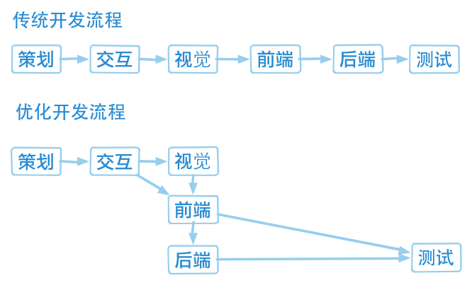

<!-- START doctoc generated TOC please keep comment here to allow auto update -->
<!-- DON'T EDIT THIS SECTION, INSTEAD RE-RUN doctoc TO UPDATE -->
**Table of Contents**  *generated with [DocToc](https://github.com/thlorenz/doctoc)*

- [网页制作](#%E7%BD%91%E9%A1%B5%E5%88%B6%E4%BD%9C)
  - [前端工程师概述](#%E5%89%8D%E7%AB%AF%E5%B7%A5%E7%A8%8B%E5%B8%88%E6%A6%82%E8%BF%B0)
  - [Photoshop](#photoshop)
  - [Development Tools](#development-tools)
  - [HTML](#html)
  - [CSS](#css)

<!-- END doctoc generated TOC please keep comment here to allow auto update -->

# 网页制作

## 前端工程师概述

**网页发展史**

Web 1.0 -> Web 2.0（基于 Ajax） -> Web 3.0 （基于 HTML5）

**网站开发协作流程**

**前端职责**

视觉稿（配色图标距离空间） + 交互稿（用户逻辑） = UI （用户界面）

视觉稿 -> [页面制作]

交互稿 -> [页面逻辑开发]

**所需技能**

- DOM (操作 HTML 及 CSS 的接口)
- JavaScript (定义页面互动)
- CSS (定义页面样式)
- HTML (定义页面结果)
- Photoshop (取图)

## Photoshop

[阅读更多](WebCreation-Photoshop.md)

## Development Tools

[阅读更多](WebCreation-DevelopmentTool.md)

## HTML

[阅读更多](WebCreation-HTML.md)

## CSS

<<<<<<< HEAD
=======
<<<<<<< HEAD
[阅读更多](WebCreation-CSS.md)
=======
>>>>>>> Note
[阅读第一部分](WebCreation-CSS-0.md)

- 简介
- 语法
- 选择器

[阅读第二部分](WebCreation-CSS-1.md)

- 文本
- 盒模型
- 背景

[阅读第三部分](WebCreation-CSS-2.md)

- 布局
- 变形
- 动画
<<<<<<< HEAD
=======
>>>>>>> li-xinyang/master
>>>>>>> Note

 This work by <a xmlns:cc="http://creativecommons.org/ns#" href="li-xinyang.com" property="cc:attributionName" rel="cc:attributionURL">Li Xinyang</a> is licensed under a <a rel="license" href="http://creativecommons.org/licenses/by-nc-sa/4.0/">Creative Commons Attribution-NonCommercial-ShareAlike 4.0 International License</a>.