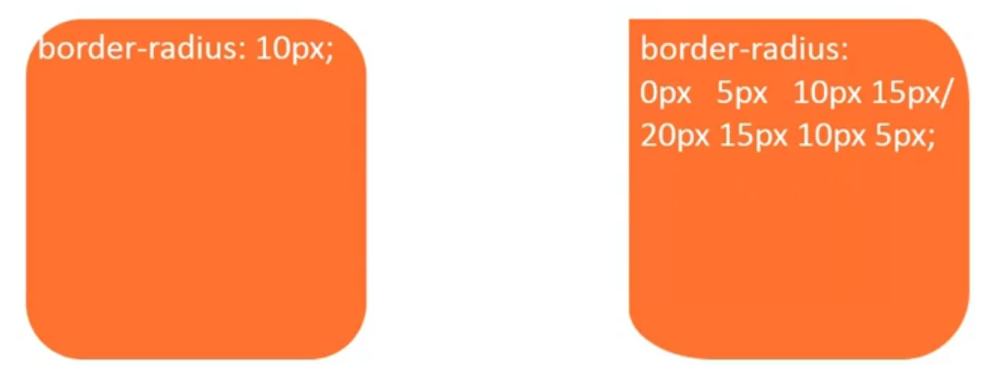
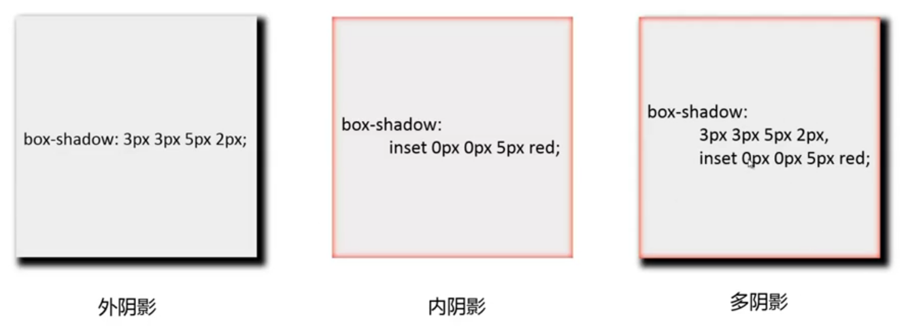

<!-- START doctoc generated TOC please keep comment here to allow auto update -->
<!-- DON'T EDIT THIS SECTION, INSTEAD RE-RUN doctoc TO UPDATE -->
**Table of Contents**  *generated with [DocToc](https://github.com/thlorenz/doctoc)*

- [盒模型](#%E7%9B%92%E6%A8%A1%E5%9E%8B)
  - [属性](#%E5%B1%9E%E6%80%A7)
    - [width](#width)
    - [height](#height)
    - [padding](#padding)
    - [margin](#margin)
      - [margin 合并](#margin-%E5%90%88%E5%B9%B6)
    - [border](#border)
    - [border-radius](#border-radius)
    - [overflow](#overflow)
    - [box-sizing](#box-sizing)
    - [box-shadow](#box-shadow)
    - [outline](#outline)
  - [TRBL](#trbl)
  - [值缩写](#%E5%80%BC%E7%BC%A9%E5%86%99)

<!-- END doctoc generated TOC please keep comment here to allow auto update -->

### 盒模型

<p data-height="268" data-theme-id="15197" data-slug-hash="qdmPEE" data-default-tab="result" data-user="li-xinyang" class='codepen'>See the Pen <a href='http://codepen.io/li-xinyang/pen/qdmPEE/'>FEND_003_BoxModel</a> by Li Xinyang (<a href='http://codepen.io/li-xinyang'>@li-xinyang</a>) on <a href='http://codepen.io'>CodePen</a>.</p>
<script async src="//assets.codepen.io/assets/embed/ei.js"></script>

#### 属性


##### width

**内容盒子宽**

`width: <length> | <percentage> | auto | inherit`

NOTE：通常情况下百分比得参照物为元素的父元素。`max-width` 与 `min-width` 可以设置最大与最小宽度。

##### height

**内容盒子高**

`height: <length> | <percentage> | auto | inherit`

NOTE：默认情况元素的高度为内容高度。`max-height` 与 `min-height` 可以设置最大与最小高度。

##### padding


`padding: [<length> | <percentage>]{1,4} | inherit`

##### margin


`margin: [<length> | <percentage> | auto]{1,4} | inherit`

NOTE：`margin` 默认值为 `auto`

Trick：

```
/* 可用于水平居中 */
margin: 0 auto;
```

###### margin 合并


毗邻元素外间距（margin）会合并，既取相对较大的值。父元素与第一个和最后一个子元素的外间距也可合并。

##### border


```
border: [<br-width> || <br-style> || <color>] | inherit
border-width: [<length> | thin | medium | thick]{1,4} | inherit
border-style: [solid | dashed | dotted | ...]{1,4} |inherit
border-colro: [<color> | transparent]{1,4} | inherit
```

NOTE：`border-color` 默认为元素字体颜色。

##### border-radius



```
/* 水平半径/垂直半径 */
border-radius: [ <length> | <percentage> ]{1,4} [ / [ <length> | <percentage> ]{1,4} ]?
```

NOTE：四个角的分解属性由左上角顺时针附值。

##### overflow


`overflow: visible | hidden | scroll | auto`

NOTE：默认属性为 `visible`。使用 `overflow-x` 与 `overflow-y` 单独的设置水平和垂直方向的滚动条。

##### box-sizing


`box-sizing: content-box | border-box | inherit`

- `content-box` = 内容盒子宽高 + 填充（`Padding`）+ 边框宽（`border-width`）
- `border-box` = 内容盒子宽高

##### box-shadow



`box-shadown: none | [inset? && [ <offset-x> <offset-y> <blur-radius>? <spread-radius>? <color>? ] ]#`

```html
box-shadow: 4px  6px   3px  0px red;
             |    |     |    |
          水平偏移|     |    |
               垂直偏移 |    |
                    模糊半径 |
                          阴影大小
```

NOTE：水平与垂直偏移可以为负值即相反方向偏移。颜色默认为文字颜色。阴影不占据空间，仅为修饰效果。

##### outline

```
outline: [ <'outline-color'> || <'outline-style'> || <'outline-width'> ]
outline-width: <length> | thin | medium | thick | inherit
outline-style: solid | dashed | dotted | ... | inherit
outline-color: <color> | invert | inherit
/* invert 与当前颜色取反色 */
```

NOTE：`outline` 与 `border` 相似但无法分别设置四个方向的属性。`outline` 并不占据空间，而 `border` 占据空间，且显示位于 `border` 以外。

#### TRBL


TRBL (Top, Right, Bottom, Left) 即为顺时针从顶部开始。具有四个方向的属性都可以通过 `*-top` `*-right` `*-bottom` 与 `*-left` 单独对其进行设置。

#### 值缩写

下面的值缩写以 `padding` 为例。

> 对面相等，后者省略；四面相等，只设一个。

```html
/*      四面值 */
padding: 20px;
padding: 20px 20px 20px 20px;

/*      上下值 右左值 */
padding: 20px   10px;
padding: 20px 10px 20px 10px;

/*       上值 右左值 下值 */
padding: 20px 10px   30px;
padding: 20px 10px 30px 10px;
```
