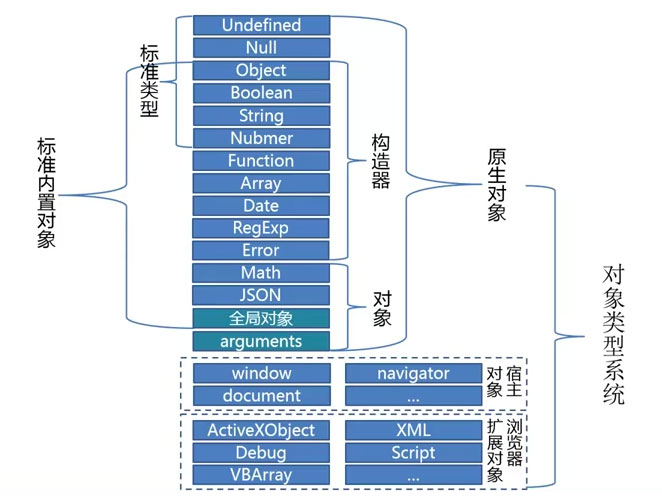

<!-- START doctoc generated TOC please keep comment here to allow auto update -->
<!-- DON'T EDIT THIS SECTION, INSTEAD RE-RUN doctoc TO UPDATE -->
**Table of Contents**  *generated with [DocToc](https://github.com/thlorenz/doctoc)*

- [类型系统](#%E7%B1%BB%E5%9E%8B%E7%B3%BB%E7%BB%9F)
  - [标准类型](#%E6%A0%87%E5%87%86%E7%B1%BB%E5%9E%8B)
  - [变量转换表](#%E5%8F%98%E9%87%8F%E8%BD%AC%E6%8D%A2%E8%A1%A8)
  - [类型识别](#%E7%B1%BB%E5%9E%8B%E8%AF%86%E5%88%AB)

<!-- END doctoc generated TOC please keep comment here to allow auto update -->

## 类型系统



### 标准类型

**原始类型**：

- Undefined
- Null
- Boolean
- String
- Number

**引用类型**：
- Object

```javascript
var obj = {};
<!-- 原始类型变量的包装类型如下 -->
var bool = new Boolean(true);
var str = new String("hello");
var num = new Number(1);
var obj0 = new Object();
```

原始类型和引用类型的区别：

原始类型储存在栈（Stack）中储存变量的值，而引用类型在栈中保存的是所引用内容储存在堆（Heap）中的值。类似于指针的概念，引用类型并非储存变量真实数值而是地址，所以对已引用类型的复制其实只是复制了相同的地址而非实际的变量值。

**Undefined** 值：undefined 出现场景：

- 以声明为赋值的变量 `var obj;`
- 获取对象不存在的属性 `var obj = {x: 0}; obj.y;`
- 无返回值函数的执行结果 `function f(){}; var obj = f();`
- 函数参数没有传入 `function f(i){console.log(i)}; f();`
- `void(expression)`

**Null** 值：null 出现场景：

- 获取不存在的对象 `document.getElementById('not-exist-element')`

**Boolean** 值：true, false 出现场景：

- 条件语句导致的系统执行的隐式类型转换 `if(隐式转换){}`
- 字面量或变量定义 `var bool = true;`

**String** 值：字符串 出现场景：

- `var str = 'Hello, world!';`

**Number** 值：整型直接量，八进制直接量（0-），十六进制直接量（0x-)，浮点型直接量 出现场景：

- `1026`
- `3.14`
- `1.2e5`
- `0x10`

**Object** 值：属性集合 出现场景：

- `var obj = {name: 'Xinyang'};`

### 变量转换表

|Value|Boolean|Number|String|
|-----|-------|------|------|
|undefined|false|NaN|"undefined"|
|null|false|0|"null"|
|true|true|1|"true"|
|false|false|0|"false"|
|''|false|0|''|
|'123'|true|123|'123'|
|'1a'|true|NaN|'1a'|
|0|false|0|"0"|
|1|true|1|"1"|
|Infinity|true|Infinity|"Infinity"|
|NaN|false|NaN|'NaN'|
|{}|true|NaN|"[object Object]"|

### 类型识别

- `typeof`
- `Object.prototype.toString`
- `constructor`
- `instanceof`

**typeof**：
- 可以是标准类型（Null 除外）
- 不可识别具体的对象类型（Function 除外）

**Object.prototype.toString**：
- 可是识别标准类型及内置对象类型（例如，Object, Date, Array）
- 不能识别自定义对象类型

**constructor**：
- 可以识别标准类型（Undefined/Null 除外）
- 可识别内置对象类型
- 可识别自定义对象类型

```javascript
function getConstructiorName(obj) {
  return obj && obj.constructor && obj.constructor.toString().match(/function\s*([^(]*)/)[1];
}
getConstructiorName([]) === "Array"; // true
```

**instanceof**：
- 不可判别原始类型
- 可判别内置对象类型
- 可判别自定义对象类型
